# BÁO CÁO BÀI TẬP LỚN HỌC MÁY CƠ BẢN

## PHÂN LOẠI GIỐNG NHO KHÔ TỪ CÁC ĐẶC TRƯNG HÌNH HỌC

**Project 18**

| Thông tin | Nội dung |
|---|---|
| Trường/Khoa | [Điền tên trường và khoa] |
| Học phần | Học máy cơ bản |
| Giảng viên | PGS.TS Nguyễn Văn Hậu |
| Nhóm | [Điền tên nhóm/lớp] |
| Thành viên 1 | [Họ tên – Mã sinh viên] |
| Thành viên 2 | [Họ tên – Mã sinh viên] |
| Năm học | [Điền năm học] |

> **Ghi chú trước khi nộp:** Điền đầy đủ thông tin ở trang bìa, bảng phân công và nhật ký; cập nhật mục tái lập sau khi chạy trên một máy sạch khác; chèn ba ảnh chụp giao diện tại các vị trí đã đánh dấu. Khi đưa sang Word, tạo mục lục, danh mục hình và danh mục bảng tự động từ các tiêu đề/chú thích.

---

## TÓM TẮT

Đề tài xây dựng một quy trình học máy và ứng dụng web hỗ trợ phân loại hai giống nho khô Kecimen và Besni từ bảy đặc trưng hình học đã được trích xuất từ ảnh. Dữ liệu sử dụng là bộ Raisin của UCI Machine Learning Repository gồm 900 mẫu cân bằng, mỗi giống có 450 mẫu. Các đặc trưng đầu vào gồm diện tích, độ dài trục lớn, độ dài trục nhỏ, độ lệch tâm, diện tích bao lồi, tỷ lệ lấp đầy và chu vi. Bài toán không nhận ảnh trực tiếp và không thực hiện bước trích xuất đặc trưng từ ảnh.

Nhóm xây dựng pipeline có thể chạy lại từ khâu tải dữ liệu, kiểm tra checksum, đánh giá chất lượng, chia dữ liệu, huấn luyện, lựa chọn mô hình, đánh giá test đến xuất artifact phục vụ web. Dữ liệu được chia phân tầng thành 720 mẫu phát triển và 180 mẫu kiểm thử độc lập bằng seed 2026. Việc lựa chọn tham số chỉ dùng tập phát triển với cross-validation 5 fold qua năm seed 11, 23, 42, 67 và 101. Chỉ số lựa chọn chính là F1-macro. Các mô hình được so sánh gồm baseline lớp phổ biến, decision stump, cây quyết định với các mức độ sâu, cây cắt tỉa theo cost-complexity pruning và Random Forest với 50, 100, 300 cây.

Theo quy tắc đã khóa trước khi mở tập test, mô hình phục vụ là cây quyết định cắt tỉa với `ccp_alpha = 0,01`. Trên tập test 180 mẫu, mô hình đạt Accuracy 83,89%, F1-macro 0,8389 và ROC-AUC 0,8741. Ma trận nhầm lẫn là `[[75, 15], [14, 76]]` theo thứ tự Kecimen/Besni. Random Forest 300 cây có cùng Accuracy 83,89%, ROC-AUC cao hơn, đạt 0,9136, nhưng F1-macro thấp hơn nhẹ, đạt 0,8385, và chênh lệch F1 giữa train và test lớn hơn đáng kể. Kết quả cho thấy mô hình cắt tỉa đạt sự cân bằng tốt giữa khả năng tổng quát, độ phức tạp và khả năng giải thích.

Mô hình được xuất sang JSON và nạp trong backend Node.js. Giao diện React + TypeScript hỗ trợ nhập một mẫu, tải CSV, xem nhãn, xác suất, chỉ số đánh giá, biểu đồ thí nghiệm và hồ sơ mô hình. Suy luận giữa Python và Node.js được đối chiếu trên 3.192 trường hợp của bốn mô hình, không có khác biệt nhãn hoặc xác suất trong ngưỡng sai số quy định. Hệ thống chỉ có vai trò hỗ trợ sàng lọc, không tự động loại sản phẩm. Các hạn chế chính là quy mô dữ liệu nhỏ, chỉ có một nguồn, thiếu ID lô/quả gốc, chưa hiệu chuẩn xác suất và chưa đánh giá trên dữ liệu dây chuyền thực tế.

**Từ khóa:** phân loại, nho khô, cây quyết định, cắt tỉa, Random Forest, React, Node.js, học máy có giám sát.

---

## MỤC LỤC

1. Bối cảnh, mục tiêu và câu hỏi nghiên cứu  
2. Cơ sở lý thuyết  
3. Dữ liệu và giấy phép sử dụng  
4. Thời điểm dự đoán và kiểm soát rò rỉ dữ liệu  
5. Phương pháp thực hiện  
6. Thiết kế thí nghiệm  
7. Kết quả và thảo luận  
8. Phân tích lỗi  
9. Thiết kế và triển khai ứng dụng web/API  
10. Kiểm thử, hiệu năng và khả năng tái lập  
11. Sử dụng có trách nhiệm và giới hạn  
12. Kết luận và hướng phát triển  
Tài liệu tham khảo  
Phụ lục

---

# 1. BỐI CẢNH, MỤC TIÊU VÀ CÂU HỎI NGHIÊN CỨU

## 1.1. Bối cảnh thực tiễn

Trong dây chuyền sơ chế và đóng gói nông sản, việc xác định giống sản phẩm có thể hỗ trợ phân luồng, thống kê và kiểm soát chất lượng. Với nho khô, một số giống có hình dạng tương đối khác nhau, nhưng sự khác biệt không phải lúc nào cũng đủ rõ để phân loại thủ công ổn định. Một hệ thống học máy có thể học quy luật từ các đại lượng hình học đã được trích xuất qua xử lý ảnh, sau đó đưa ra dự đoán nhất quán cho từng mẫu mới.

Đề tài tập trung vào hai giống Kecimen và Besni. Một dòng dữ liệu đại diện cho một quả nho khô và gồm bảy phép đo hình học. Hệ thống nhận các phép đo này, kiểm tra tính hợp lệ, đưa chúng qua mô hình đã huấn luyện và trả về nhãn dự đoán cùng xác suất của hai lớp. Phạm vi này phù hợp với dữ liệu nguồn vì UCI chỉ cung cấp bảng đặc trưng, không cung cấp ảnh thô để xây dựng một pipeline thị giác máy tính hoàn chỉnh.

Ứng dụng được định vị là công cụ hỗ trợ sàng lọc và minh họa quy trình học máy. Kết quả không được dùng như một quyết định tự động để loại sản phẩm. Người vận hành vẫn chịu trách nhiệm xem xét kết quả, điều kiện đo và các giới hạn của mô hình.

## 1.2. Mục tiêu tổng quát

Mục tiêu tổng quát của đề tài là xây dựng một pipeline phân loại có thể tái lập, đánh giá trung thực và tích hợp được vào ứng dụng web. Pipeline phải thể hiện đầy đủ các bước từ dữ liệu thô đến mô hình phục vụ, đồng thời chứng minh rằng việc chọn mô hình không sử dụng thông tin từ tập test.

## 1.3. Mục tiêu cụ thể

- Thu thập bộ dữ liệu Raisin từ nguồn chính thức, ghi lại ngày tải, checksum, giấy phép và trích dẫn.
- Kiểm tra schema, giá trị thiếu, trùng lặp, tính hữu hạn và các ràng buộc hình học cơ bản.
- Xây dựng baseline lớp phổ biến và decision stump để tạo mốc so sánh.
- Khảo sát ảnh hưởng của độ sâu cây và tham số cắt tỉa `ccp_alpha`.
- So sánh Random Forest với 50, 100 và 300 cây trong cùng giao thức đánh giá.
- Đánh giá độ ổn định qua nhiều seed, báo cáo trung bình và độ lệch chuẩn.
- Khóa mô hình trước khi mở test và đánh giá một lần trên tập test độc lập.
- Phân tích ma trận nhầm lẫn, chất lượng theo lớp, chênh lệch train–test và các nhóm có tỷ lệ lỗi cao.
- Xuất mô hình sang định dạng dùng được trong Node.js và kiểm tra tính tương đương với Python.
- Xây dựng ứng dụng web gồm trang giới thiệu, trang phân loại và dashboard đánh giá/model card.

## 1.4. Câu hỏi nghiên cứu

Đề tài trả lời bốn câu hỏi chính:

1. Cây quyết định có vượt các baseline đơn giản trên dữ liệu chưa học hay không?
2. Độ sâu và cắt tỉa ảnh hưởng thế nào đến chênh lệch giữa chất lượng train và validation?
3. Random Forest có cải thiện F1-macro, ROC-AUC hoặc độ ổn định so với cây cắt tỉa hay không?
4. Mô hình được chọn có thể chuyển sang backend Node.js mà vẫn giữ nguyên nhãn và xác suất hay không?

## 1.5. Phạm vi đề tài

Đề tài thực hiện phân loại nhị phân Kecimen/Besni từ bảy số đo đã có. Phần bắt buộc gồm quản trị dữ liệu, thí nghiệm cây/rừng, đánh giá test, phân tích lỗi, web/API, model card và mã nguồn tái lập. Đề tài không nhận ảnh hoặc camera, không trích xuất đặc trưng từ ảnh, không quản lý kho, không dùng cơ sở dữ liệu người dùng và không huấn luyện lại từ CSV tải lên. Cloud, mobile app, deep learning, phát hiện ngoài miền và permutation importance nằm ngoài phạm vi tối thiểu.

---

# 2. CƠ SỞ LÝ THUYẾT

## 2.1. Bài toán phân loại có giám sát

Trong học có giám sát, mô hình học ánh xạ từ vector đặc trưng **x** sang nhãn **y** dựa trên các mẫu đã biết nhãn. Với đề tài này:

- **x** gồm bảy đặc trưng hình học;
- **y = 0** tương ứng Kecimen;
- **y = 1** tương ứng Besni.

Mô hình không chỉ trả nhãn mà còn trả xác suất ước lượng cho từng lớp. Quy tắc ra nhãn của dự án là: nếu `P(Besni) ≥ 0,5` thì dự đoán Besni, ngược lại dự đoán Kecimen. Trường hợp đúng bằng 0,5 được xếp vào Besni. Xác suất này là tỷ lệ lớp tại lá đối với cây hoặc trung bình xác suất của các cây trong rừng; nó chưa được hiệu chuẩn nên không được hiểu như cam kết rằng từng dự đoán sẽ đúng với tần suất tương ứng.

## 2.2. Cây quyết định

Cây quyết định phân chia không gian đặc trưng bằng một chuỗi điều kiện. Mỗi nút trong chứa một câu hỏi dạng `x_j ≤ t`; mẫu thỏa điều kiện đi sang nhánh trái, mẫu còn lại đi sang nhánh phải. Quá trình tiếp tục đến một nút lá. Nhãn và xác suất được suy ra từ phân bố lớp của các mẫu train trong lá đó.

Ưu điểm của cây quyết định là dễ giải thích, không đòi hỏi chuẩn hóa thang đo, xử lý được quan hệ phi tuyến và tương tác giữa các biến. Nhược điểm là độ bất ổn cao và dễ học quá sát dữ liệu train nếu cây phát triển quá sâu.

## 2.3. Chỉ số Gini và lựa chọn phép chia

Với một nút `t`, gọi `p_tk` là tỷ lệ mẫu thuộc lớp `k`, độ không thuần Gini được tính bởi:

`G(t) = 1 − Σ_k p_tk²`

Trong bài toán nhị phân, nếu `p` là tỷ lệ lớp dương thì:

`G(t) = 2p(1 − p)`

Nút thuần có Gini bằng 0; nút nhị phân cân bằng có Gini bằng 0,5. Với một phép chia tạo nút trái `L` và nút phải `R`, độ không thuần sau chia là:

`G_sau = (n_L / n_t)G(L) + (n_R / n_t)G(R)`

Độ giảm Gini cục bộ là:

`Δ_t = G(t) − G_sau`

Thuật toán CART xét các ngưỡng hợp lệ và chọn phép chia tạo mức giảm lớn nhất. Việc cân theo số mẫu rất quan trọng vì một lá nhỏ không thể có trọng lượng ngang toàn bộ phần dữ liệu còn lại.

## 2.4. Kiểm soát độ phức tạp và cắt tỉa

Cây tự do có thể tạo nhiều lá nhỏ và đạt điểm train rất cao nhưng tổng quát kém. Có thể kiểm soát độ phức tạp bằng giới hạn `max_depth`, `min_samples_leaf` hoặc cắt tỉa sau huấn luyện. Đề tài sử dụng cost-complexity pruning với hàm mục tiêu:

`R_α(T) = R(T) + α|L(T)|`

Trong đó `R(T)` là tổng độ không thuần có trọng số của các lá, `|L(T)|` là số lá và `α ≥ 0` là mức phạt độ phức tạp. Khi `α` tăng, mô hình ưu tiên cây ít lá hơn. `α` phải được chọn trên validation/CV; không được chọn bằng kết quả test.

## 2.5. Random Forest

Random Forest là tập hợp nhiều cây quyết định. Mỗi cây được huấn luyện trên một mẫu bootstrap và chỉ xem một tập con ngẫu nhiên của đặc trưng ở mỗi lần chia. Với phân loại, xác suất cuối cùng là trung bình xác suất từ các cây. Cách làm này giảm phương sai khi các cây không hoàn toàn tương quan.

Tăng số cây thường làm kết quả ổn định hơn nhưng không bảo đảm Accuracy hay F1 luôn tăng. Nếu các cây có cùng phương sai `σ²` và tương quan cặp `ρ`, phương sai trung bình có dạng:

`Var(trung bình) = σ²[ρ + (1 − ρ)/B]`

với `B` là số cây. Khi `B` tăng, phần `(1 − ρ)/B` giảm nhưng thành phần do tương quan `ρ` vẫn còn. Vì vậy cần đo trực tiếp hiệu quả của 50, 100 và 300 cây thay vì mặc định số cây lớn nhất luôn tốt hơn.

## 2.6. Các chỉ số đánh giá

Với mỗi lớp, `TP`, `FP`, `FN`, `TN` lần lượt là dự đoán đúng dương, dự đoán nhầm dương, bỏ sót dương và dự đoán đúng âm.

- **Accuracy** = `(TP + TN) / N`, thể hiện tỷ lệ dự đoán đúng trên toàn bộ mẫu.
- **Precision** = `TP / (TP + FP)`, thể hiện mức chính xác trong các dự đoán của một lớp.
- **Recall** = `TP / (TP + FN)`, thể hiện tỷ lệ mẫu của lớp được nhận ra.
- **F1** = `2 × Precision × Recall / (Precision + Recall)`.
- **F1-macro** là trung bình F1 của hai lớp, mỗi lớp có trọng số ngang nhau.
- **ROC-AUC** đánh giá khả năng xếp hạng lớp dương qua mọi ngưỡng; 0,5 tương đương xếp hạng ngẫu nhiên và 1,0 là hoàn hảo.

Dữ liệu nguồn cân bằng, tuy nhiên F1-macro vẫn được chọn làm chỉ số chính vì nó buộc mô hình duy trì chất lượng trên cả hai giống. Accuracy, ROC-AUC, ma trận nhầm lẫn và điểm theo lớp được báo kèm để tránh kết luận chỉ dựa trên một con số.

---

# 3. DỮ LIỆU VÀ GIẤY PHÉP SỬ DỤNG

## 3.1. Nguồn dữ liệu

Dữ liệu được lấy từ bộ **Raisin** tại UCI Machine Learning Repository, mã dữ liệu 850. Gói dữ liệu được tải ngày 29/09/2026. Nhóm giữ bản ZIP gốc ở môi trường cục bộ và cung cấp script tải/kiểm tra để máy khác có thể tái tạo dữ liệu. SHA-256 của gói chính thức đã dùng là:

`5d516c040923fd154ecf85e31b6e1b5a096724fa0e68d588c33fb5a2f0c3e5db`

UCI công bố bộ dữ liệu theo giấy phép CC BY 4.0. Khi sử dụng và chia sẻ, nhóm ghi công tác giả, liên kết giấy phép và mô tả các thay đổi. Trích dẫn dữ liệu:

> Çinar, İ., Koklu, M., & Tasdemir, S. (2020). *Raisin [Dataset].* UCI Machine Learning Repository. https://doi.org/10.24432/C5660T

Bài báo liên quan do tác giả yêu cầu trích dẫn:

> Cinar, I., Koklu, M., & Tasdemir, S. (2020). *Classification of Raisin Grains Using Machine Vision and Artificial Intelligence Methods.* Gazi Journal of Engineering Sciences, 6(3), 200–209. https://doi.org/10.30855/gmbd.2020.03.03

## 3.2. Cấu trúc dữ liệu

Tệp Excel nguồn gồm 900 mẫu, bảy đặc trưng và một cột nhãn. Hai lớp cân bằng tuyệt đối: 450 Kecimen và 450 Besni.

| Biến | Kiểu/đơn vị | Ý nghĩa | Vai trò |
|---|---|---|---|
| `Area` | Số nguyên, pixel² | Diện tích vùng quả nho | Đặc trưng |
| `MajorAxisLength` | Số thực, pixel | Độ dài trục lớn | Đặc trưng |
| `MinorAxisLength` | Số thực, pixel | Độ dài trục nhỏ | Đặc trưng |
| `Eccentricity` | Số thực, không đơn vị | Độ lệch tâm của ellipse tương đương | Đặc trưng |
| `ConvexArea` | Số nguyên, pixel² | Diện tích bao lồi nhỏ nhất | Đặc trưng |
| `Extent` | Số thực, không đơn vị | Diện tích đối tượng chia diện tích hộp bao | Đặc trưng |
| `Perimeter` | Số thực, pixel | Chu vi đường bao | Đặc trưng |
| `Class` | Chuỗi | `Kecimen` hoặc `Besni` | Nhãn |

`Class` chỉ được sử dụng khi huấn luyện và đánh giá, không xuất hiện trong form hoặc CSV dự đoán. Dữ liệu không cung cấp ảnh thô, đơn vị vật lý theo milimét, ID quả hoặc ID lô. Do đó không thể tự suy ra tính độc lập theo lô và không được đổi các phép đo pixel sang đơn vị vật lý.

## 3.3. Kiểm tra chất lượng dữ liệu

Pipeline kiểm tra tên và thứ tự cột, kiểu số, giá trị hữu hạn, miền hợp lệ và các quan hệ hình học cơ bản. Kết quả kiểm tra:

- 900/900 dòng được giữ nguyên;
- không có giá trị thiếu ở bất kỳ cột nào;
- không có dòng trùng hoàn toàn;
- không có vector đặc trưng trùng nhau;
- không có nhóm cùng đặc trưng nhưng khác nhãn;
- không có dòng vi phạm `MajorAxisLength ≥ MinorAxisLength`;
- không có dòng vi phạm `ConvexArea ≥ Area`;
- không có giá trị `Eccentricity` ngoài `[0, 1]`;
- không có giá trị `Extent` ngoài `(0, 1]`;
- không loại dòng và không sửa giá trị nguồn.

Nhóm không loại ngoại lệ bằng quy tắc thống kê vì một giá trị hiếm chưa chắc là lỗi đo. Việc loại theo toàn bộ dữ liệu cũng có thể đưa thông tin của test vào quá trình chuẩn bị. Các biểu đồ khám phá và ngưỡng nhóm lỗi được xác định trên tập phát triển sau khi chia dữ liệu.

## 3.4. Khám phá dữ liệu

Biểu đồ phân bố cho thấy các đặc trưng hình học có miền và thang đo khác nhau. `Area` và `ConvexArea` có quan hệ mạnh vì cùng mô tả diện tích; `MajorAxisLength`, `MinorAxisLength` và `Perimeter` cũng liên hệ với kích thước tổng thể. Tuy vậy, tương quan không được diễn giải như quan hệ nhân quả và không phải lý do tự động xóa một cột. Cây quyết định có thể chọn đặc trưng/ngưỡng phù hợp mà không yêu cầu chuẩn hóa.

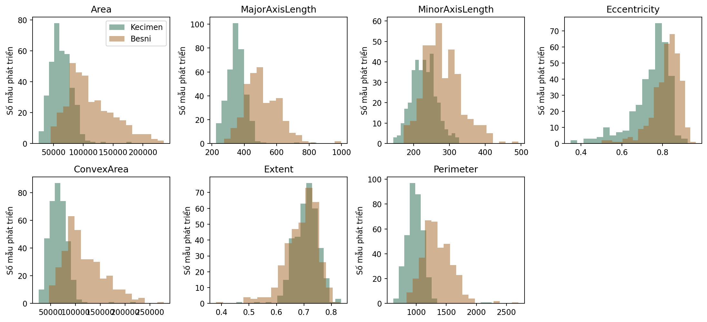

**Hình 1.** Phân bố bảy đặc trưng trên tập phát triển.

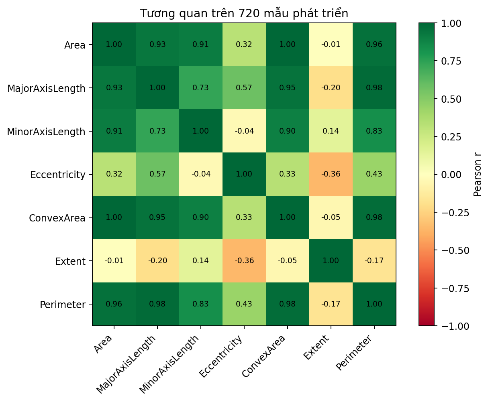

**Hình 2.** Ma trận tương quan của các đặc trưng trên tập phát triển.

---

# 4. THỜI ĐIỂM DỰ ĐOÁN VÀ KIỂM SOÁT RÒ RỈ DỮ LIỆU

## 4.1. Thời điểm dự đoán

Thời điểm dự đoán là sau khi hệ thống xử lý ảnh hoặc thiết bị đo đã tạo đủ bảy đặc trưng hình học, nhưng trước khi biết giống thật của mẫu. Vì vậy, bảy đặc trưng đều có sẵn hợp lệ tại thời điểm dự đoán; `Class` chỉ xuất hiện về sau để huấn luyện hoặc đối chiếu.

Một request dự đoán không được sử dụng nhãn, ID dòng, vị trí của dòng trong tệp hoặc thông tin được tạo sau kết quả. CSV người dùng tải lên chỉ dùng suy luận, không được tự động thêm vào tập train.

## 4.2. Chia tập trước thí nghiệm

Sau kiểm tra chất lượng, dữ liệu được chia phân tầng một lần bằng `random_state = 2026`:

| Tập | Tổng số mẫu | Kecimen | Besni | Mục đích |
|---|---:|---:|---:|---|
| Phát triển | 720 | 360 | 360 | EDA, CV, chọn mô hình và fit cuối |
| Test | 180 | 90 | 90 | Đánh giá cuối một lần |

Danh sách ID dòng của hai tập và các fold được lưu trong `data/splits.json`; checksum của split được ghi trong `models/selection_lock.json`. Tập test không được dùng để chọn độ sâu, `ccp_alpha`, số cây, đặc trưng hoặc ngưỡng 0,5.

## 4.3. Cross-validation và nhiều seed

Trên 720 mẫu phát triển, nhóm dùng Stratified K-Fold với 5 fold cho từng seed trong tập `{11, 23, 42, 67, 101}`. Mỗi ứng viên vì vậy được đánh giá qua 25 lượt train/validation. Với mỗi seed, năm fold được gộp thành một trung bình; báo cáo `mean ± std` được tính trên năm trung bình theo seed. Độ lệch chuẩn này mô tả mức dao động giữa các seed, không phải khoảng tin cậy.

Sử dụng nhiều seed là cần thiết vì dữ liệu chỉ có 900 mẫu. Một lần chia fold thuận lợi có thể làm điểm số cao hơn hoặc thấp hơn đáng kể. Báo cáo toàn bộ seed giúp tránh chọn mô hình theo một phép chia may mắn.

## 4.4. Tiền xử lý

Pipeline không điền thiếu, không chuẩn hóa, không mã hóa và không chọn đặc trưng bằng thuật toán học. Lý do là dữ liệu đã đầy đủ, mọi đầu vào đều là số và mô hình cây không phụ thuộc khoảng cách Euclid. Việc không có bước học tiền xử lý cũng làm giảm bề mặt rò rỉ. Dù vậy, schema, thứ tự đặc trưng và mọi ràng buộc đầu vào vẫn được lưu cùng artifact để serving thực hiện đúng như lúc huấn luyện.

## 4.5. Khóa lựa chọn trước test

Trước khi đánh giá test, dự án lưu:

- protocol và checksum;
- split và checksum;
- danh sách ứng viên đã chọn theo từng họ mô hình;
- artifact Python và JSON;
- SHA-256 của từng artifact;
- phiên bản thư viện;
- mô hình dùng serving và quy tắc ngưỡng.

Tệp khóa ghi rõ `selection_basis = Development CV only, before final test` và `test_used_for_selection = false`. Chỉ sau bước này `ml/evaluate.py` mới đọc tập test để tạo kết quả cuối.

---

# 5. PHƯƠNG PHÁP THỰC HIỆN

## 5.1. Quy trình tổng thể

Pipeline gồm các bước:

1. `ml/download_data.py` tải hoặc kiểm tra gói UCI bằng checksum.
2. `ml/data.py` đọc Excel, kiểm schema/chất lượng và tạo split cố định.
3. `ml/train.py` chạy baseline và các thí nghiệm trên tập phát triển.
4. Script khóa mô hình, cấu hình và checksum trước khi mở test.
5. `ml/check_parity.py` tạo các ca đối chiếu suy luận không dùng mẫu test.
6. `ml/evaluate.py` đánh giá các mô hình đã khóa trên test và xuất hình/bảng.
7. Backend Node.js nạp artifact JSON đã chọn và phục vụ API.
8. Frontend React gọi API để hiển thị kết quả và bằng chứng đánh giá.

## 5.2. Baseline lớp phổ biến

Baseline đầu tiên luôn dự đoán lớp phổ biến trong phần train của fold. Vì dữ liệu cân bằng, nếu hòa thì quy tắc cố định chọn Kecimen. Baseline này cho Accuracy khoảng 50% và F1-macro 0,3333. Nó xác nhận rằng một mô hình chỉ dự đoán một lớp không giải quyết được bài toán dù Accuracy có thể nhìn không quá thấp trong một số dữ liệu lệch lớp.

## 5.3. Decision stump

Decision stump là cây có `max_depth = 1`. Mô hình chỉ tạo một phép chia và hai lá. Đây là baseline học máy đơn giản để kiểm tra xem chỉ một quy tắc hình học đã mang lại tín hiệu phân loại đáng kể hay chưa. Stump cũng giúp đánh giá phần cải thiện thật sự của cây phức tạp hơn.

## 5.4. Thí nghiệm độ sâu

Nhóm khảo sát `max_depth ∈ {1, 2, 3, 4, 5, 6, 8, 10, 12, None}`, giữ `min_samples_leaf = 1` và `ccp_alpha = 0`. Mỗi cấu hình được đánh giá cùng split, fold và seed. Mục đích là quan sát đường cong train/validation và xác định thời điểm mô hình bắt đầu quá khớp.

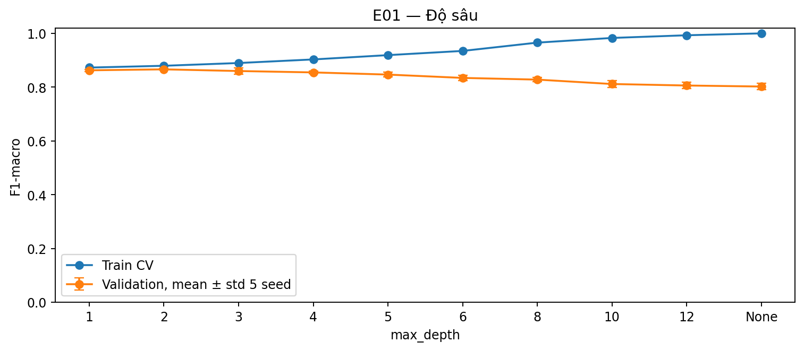

**Hình 3.** F1-macro train và validation theo độ sâu cây.

## 5.5. Thí nghiệm cắt tỉa

Nhóm chạy cây không giới hạn độ sâu với `ccp_alpha ∈ {0; 0,00001; 0,0001; 0,001; 0,003; 0,01; 0,03; 0,1}`. `alpha = 0` được giữ làm đối chứng không cắt tỉa. Protocol quy định mô hình cây cuối phải được chọn trong các mức alpha dương; điều này bảo đảm mô hình phục vụ thực sự là cây đã cắt tỉa theo yêu cầu của đề.

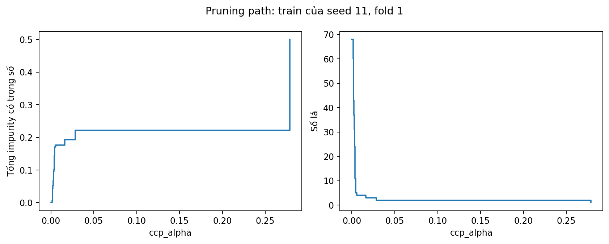

**Hình 4.** Cost-complexity pruning path.

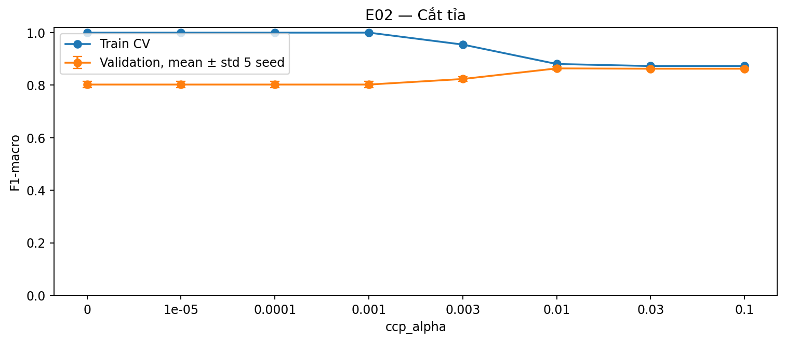

**Hình 5.** Chất lượng train/validation theo `ccp_alpha`.

## 5.6. Thí nghiệm Random Forest

Random Forest dùng `max_depth = 8`, `min_samples_leaf = 2`, `max_features = sqrt`, bootstrap và lần lượt 50, 100, 300 cây. Các cấu hình dùng cùng fold và seed với cây quyết định. `n_jobs = 1` được dùng khi tạo kết quả chính thức để hạn chế biến động môi trường và làm phép đo thời gian dễ đối chiếu hơn.

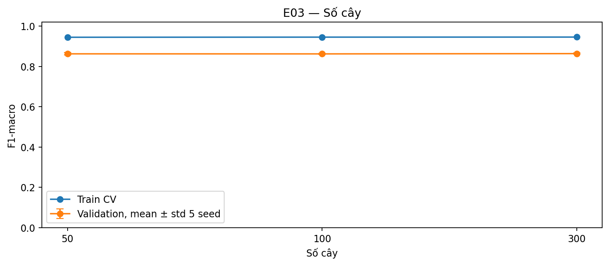

**Hình 6.** F1-macro và thời gian theo số cây trong Random Forest.

## 5.7. Quy tắc chọn mô hình

Chỉ số chọn chính là F1-macro validation trung bình. Khi điểm bằng nhau đến 12 chữ số thập phân, ưu tiên lần lượt số lá trung bình nhỏ hơn, số cây nhỏ hơn và mã ứng viên theo thứ tự xác định. Mô hình cuối được fit trên toàn bộ 720 mẫu phát triển bằng seed 42. Ngưỡng phân loại 0,5 được cố định từ protocol, không tối ưu theo test.

Đối với cây chính, protocol chọn trong họ cây cắt tỉa có alpha dương. Đối với rừng, ứng viên có F1-macro CV tốt nhất là 300 cây. Sau đó nhóm so sánh đại diện của bốn vai trò: lớp phổ biến, stump, cây cắt tỉa và rừng.

---

# 6. THIẾT KẾ THÍ NGHIỆM

## 6.1. Các biến kiểm soát

Để bảo đảm so sánh công bằng, mọi ứng viên dùng cùng 720 mẫu phát triển, cùng danh sách fold, cùng năm seed, cùng bảy đặc trưng và cùng cách tính metric. Tập test được giữ nguyên cho mọi mô hình. Không mô hình nào được chọn lại sau khi xem test.

## 6.2. Bốn thí nghiệm bắt buộc

| Mã | Mục tiêu | Biến thay đổi | Đầu ra chính |
|---|---|---|---|
| E01 | Đánh giá ảnh hưởng độ sâu | `max_depth` | F1 train/validation, số lá |
| E02 | Chọn mức cắt tỉa | `ccp_alpha` | F1, ROC-AUC, số lá |
| E03 | So sánh kích thước rừng | 50/100/300 cây | F1, AUC, thời gian |
| E04 | Đánh giá độ ổn định | 5 seed | Mean ± std theo seed |

## 6.3. Giả thuyết trước thí nghiệm

- Cây quá nông có thiên lệch cao nhưng ổn định và dễ giải thích.
- Cây không giới hạn độ sâu có thể đạt train gần 100% nhưng validation giảm.
- Cắt tỉa phù hợp có thể thu hẹp khoảng cách train–validation.
- Random Forest có thể tăng ROC-AUC và ổn định hơn nhờ trung bình nhiều cây, nhưng tốn thời gian và khó giải thích hơn.
- Tăng từ 100 lên 300 cây có thể chỉ mang lại cải thiện nhỏ vì lợi ích giảm dần.

## 6.4. Minh chứng được lưu

Mỗi lần chạy lưu cấu hình, kết quả theo seed, điểm tổng hợp, hình và checksum artifact. Các số trong báo cáo lấy từ `reports/cv_summary.json`, `reports/evaluation.json`, `models/metadata.json` và các hình ở `reports/figures/`; không nhập lại số liệu bằng tay vào code phục vụ.

---

# 7. KẾT QUẢ VÀ THẢO LUẬN

## 7.1. Kết quả cross-validation trên tập phát triển

| Mô hình/ứng viên | Accuracy CV | F1-macro CV | F1 train | ROC-AUC CV | Độ phức tạp trung bình |
|---|---:|---:|---:|---:|---:|
| Lớp phổ biến | 0,5000 ± 0,0000 | 0,3333 ± 0,0000 | 0,3333 | 0,5000 ± 0,0000 | 1 lá |
| Decision stump | 0,8628 ± 0,0040 | 0,8626 ± 0,0040 | 0,8728 | 0,8628 ± 0,0040 | 2 lá |
| Cây sâu 2 | 0,8664 ± 0,0027 | 0,8662 ± 0,0027 | 0,8795 | 0,9039 ± 0,0042 | 4 lá |
| Cây cắt tỉa `alpha=0,01` | 0,8639 ± 0,0050 | 0,8638 ± 0,0050 | 0,8806 | 0,9008 ± 0,0017 | 3,92 lá |
| Random Forest 50 cây | 0,8628 ± 0,0058 | 0,8625 ± 0,0057 | 0,9448 | 0,9278 ± 0,0029 | 39,22 lá/cây |
| Random Forest 100 cây | 0,8625 ± 0,0031 | 0,8622 ± 0,0031 | 0,9454 | 0,9296 ± 0,0034 | 39,22 lá/cây |
| Random Forest 300 cây | 0,8639 ± 0,0035 | 0,8636 ± 0,0035 | 0,9457 | 0,9300 ± 0,0025 | 39,26 lá/cây |

**Nhận xét.** Baseline lớp phổ biến chỉ đạt F1-macro 0,3333, trong khi decision stump đã đạt 0,8626. Điều này cho thấy một phép chia hình học đơn giản đã chứa tín hiệu phân biệt mạnh. Cây sâu 2 đạt F1-macro CV cao nhất trong thí nghiệm độ sâu, 0,8662, nhưng mục tiêu của mô hình cây chính là đánh giá cắt tỉa cost-complexity. Trong các cây có alpha dương, `alpha = 0,01` tốt nhất theo F1-macro và chỉ có khoảng bốn lá.

Random Forest 300 cây đạt F1-macro 0,8636, thấp hơn cây `alpha = 0,01` khoảng 0,00013 nhưng ROC-AUC cao hơn đáng kể. Chênh lệch F1 nhỏ hơn độ dao động giữa seed nên không có cơ sở khẳng định rừng thua về khả năng phân loại nói chung. Tuy nhiên, theo tiêu chí chọn đã khóa và ưu tiên mô hình đơn giản khi chất lượng tương đương, cây cắt tỉa được chọn để phục vụ.

## 7.2. Ảnh hưởng của độ sâu

Cây sâu 2 có F1 validation tốt nhất trong lưới độ sâu. Khi tăng sâu hơn, F1 train tiếp tục tăng nhưng F1 validation giảm: cây không giới hạn sâu đạt F1 train 1,0000 nhưng F1 validation chỉ khoảng 0,8023. Đây là dấu hiệu rõ của quá khớp. Kết quả phù hợp với lý thuyết: cây sâu có đủ khả năng tạo lá thuần trên train nhưng các quy tắc hẹp không ổn định trên mẫu mới.

Việc chỉ nhìn Accuracy train sẽ dẫn đến lựa chọn sai. Đường cong train/validation cho thấy mục tiêu không phải tối đa hóa độ khớp train mà là tìm mức phức tạp giữ được khả năng tổng quát.

## 7.3. Ảnh hưởng của cắt tỉa

Với alpha rất nhỏ từ 0 đến 0,001, cây gần như không bị cắt và F1 validation chỉ khoảng 0,8023. `alpha = 0,003` cải thiện F1 lên khoảng 0,8235 nhưng khoảng cách train–validation vẫn lớn. `alpha = 0,01` làm giảm số lá từ khoảng 68 xuống khoảng 4 và tăng F1 validation lên 0,8638. Khi alpha tăng lên 0,03 hoặc 0,1, cây chỉ còn khoảng hai lá và F1 giảm nhẹ còn 0,8626. Vì vậy `alpha = 0,01` là điểm cân bằng tốt nhất trong lưới cắt tỉa.

## 7.4. Ảnh hưởng của số cây trong Random Forest

Từ 50 đến 300 cây, ROC-AUC tăng từ 0,9278 lên 0,9300 và độ lệch chuẩn F1 giảm từ 0,0057 xuống 0,0035. F1-macro không tăng đơn điệu: 50 cây đạt 0,8625; 100 cây đạt 0,8622; 300 cây đạt 0,8636. Trong khi đó thời gian fit trung bình tăng gần tuyến tính, từ khoảng 166,57 ms lên 1.011,77 ms trong phép đo CV của môi trường thí nghiệm.

Kết quả xác nhận tăng số cây chủ yếu giúp ổn định và cải thiện xếp hạng nhẹ, không tự động giải quyết quá khớp hay bảo đảm Accuracy tăng. Nếu chỉ xét F1 và chi phí tính toán, 50 cây đã là một phương án cạnh tranh; theo quy tắc chọn trong họ rừng, 300 cây được giữ làm đại diện vì có F1 cao nhất.

## 7.5. Độ ổn định qua seed

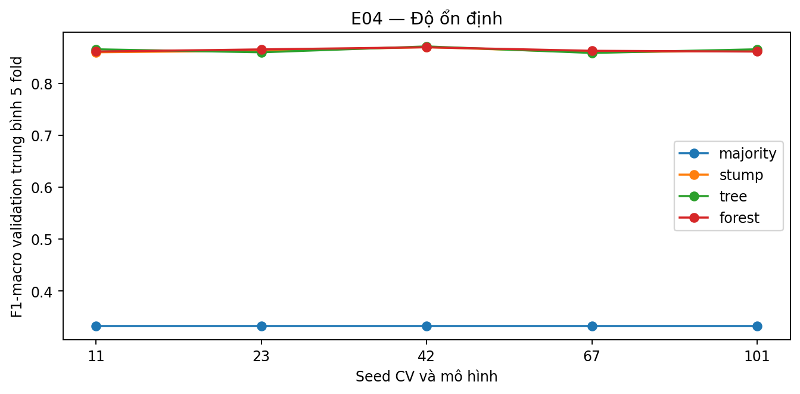

**Hình 7.** F1-macro của các mô hình qua năm seed.

Cây cắt tỉa có F1 theo seed từ 0,8582 đến 0,8707; Random Forest 300 cây từ 0,8609 đến 0,8691. Biên độ nhỏ cho thấy kết luận không phụ thuộc vào một seed duy nhất. Rừng có độ lệch chuẩn nhỏ hơn cây cắt tỉa, nhưng mức chênh lệch trung bình giữa hai mô hình rất nhỏ. Việc báo cả mean và std giúp mô tả trung thực sự không chắc chắn do chia fold.

## 7.6. Kết quả trên tập test độc lập

Sau khi khóa mô hình, bốn mô hình đại diện được đánh giá trên 180 mẫu test:

| Mô hình | Accuracy test | F1-macro test | ROC-AUC test | Chênh F1 train–test |
|---|---:|---:|---:|---:|
| Lớp phổ biến | 50,00% | 0,3333 | 0,5000 | 0,00 điểm % |
| Decision stump | 82,78% | 0,8278 | 0,8278 | 4,44 điểm % |
| Cây cắt tỉa `alpha=0,01` | **83,89%** | **0,8389** | 0,8741 | **4,17 điểm %** |
| Random Forest 300 cây | **83,89%** | 0,8385 | **0,9136** | 10,17 điểm % |

Cả cây cắt tỉa và Random Forest đều vượt rõ baseline lớp phổ biến. So với stump, cây cắt tỉa tăng khoảng 1,11 điểm phần trăm Accuracy và 0,0111 F1-macro. Random Forest có cùng Accuracy với cây nhưng F1 thấp hơn rất nhẹ. Ngược lại, AUC của rừng cao hơn 0,0395, cho thấy rừng xếp hạng xác suất tốt hơn qua nhiều ngưỡng.

Mô hình phục vụ vẫn là cây cắt tỉa vì tiêu chí chính là F1-macro, lựa chọn đã được khóa từ CV và cây có khoảng cách train–test nhỏ hơn. Không đổi sang Random Forest sau khi thấy AUC test cao hơn vì làm như vậy sẽ dùng test để chọn mô hình.

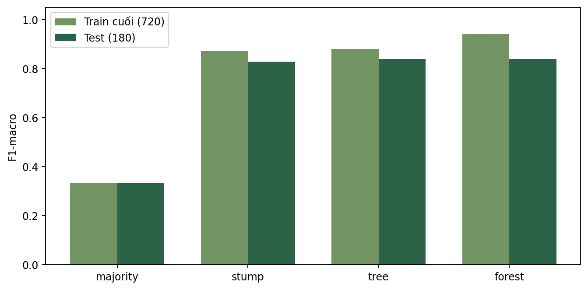

**Hình 8.** Chênh lệch metric train–test của các mô hình đã khóa.

## 7.7. Ma trận nhầm lẫn và chất lượng theo lớp

Ma trận nhầm lẫn của cây cắt tỉa, với hàng là nhãn thật và cột là nhãn dự đoán:

| Nhãn thật \ Dự đoán | Kecimen | Besni |
|---|---:|---:|
| Kecimen | 75 | 15 |
| Besni | 14 | 76 |

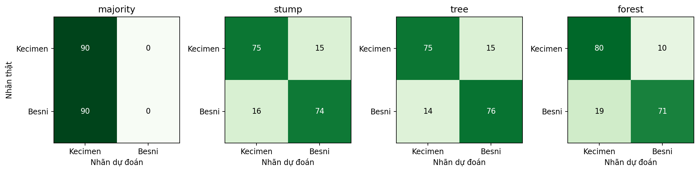

**Hình 9.** Ma trận nhầm lẫn trên tập test.

| Lớp | Precision | Recall | F1 | Số mẫu |
|---|---:|---:|---:|---:|
| Kecimen | 0,8427 | 0,8333 | 0,8380 | 90 |
| Besni | 0,8352 | 0,8444 | 0,8398 | 90 |

Chất lượng hai lớp khá cân bằng. Mô hình nhận đúng 75/90 mẫu Kecimen và 76/90 mẫu Besni. Chênh lệch recall chỉ khoảng 1,11 điểm phần trăm và chênh lệch F1 dưới 0,002. Vì hai loại sai đều có số lượng gần nhau, chưa thấy dấu hiệu mô hình thiên mạnh về một giống.

## 7.8. Đường ROC

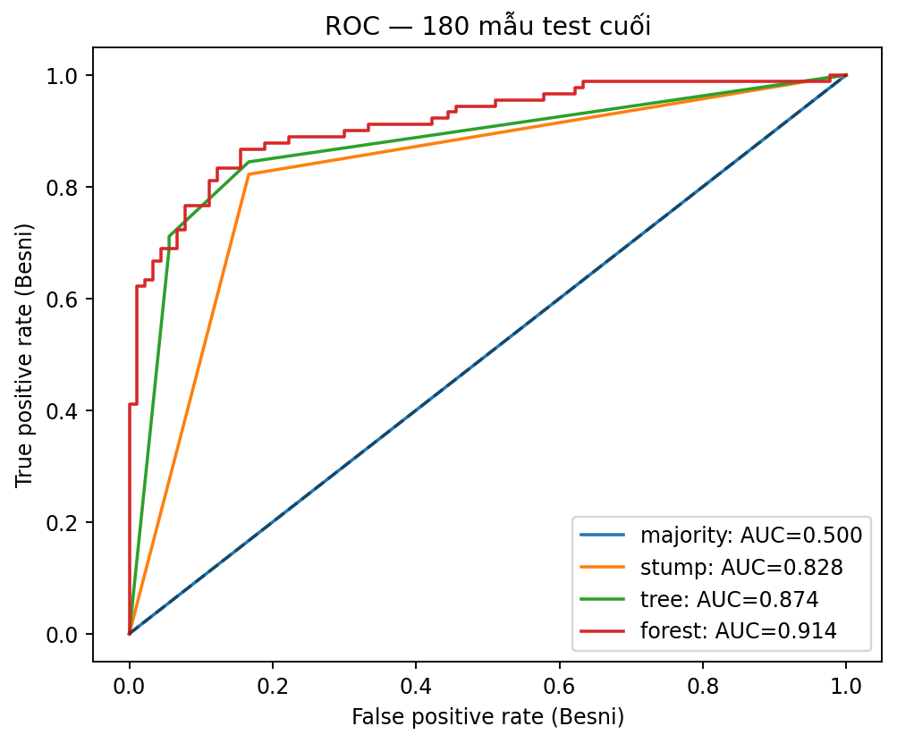

**Hình 10.** Đường ROC của các mô hình trên test.

Random Forest đạt ROC-AUC tốt nhất, 0,9136, trong khi cây cắt tỉa đạt 0,8741. Điều này cho thấy nếu mục tiêu tương lai chuyển sang xếp hạng hoặc lựa chọn một ngưỡng theo chi phí nghiệp vụ, rừng là ứng viên cần xem xét. Tuy nhiên dự án hiện chưa có ma trận chi phí thật và đã cố định ngưỡng 0,5. Vì vậy không tối ưu ngưỡng trên test và không thay đổi quyết định phục vụ sau đánh giá.

## 7.9. Diễn giải cây cuối

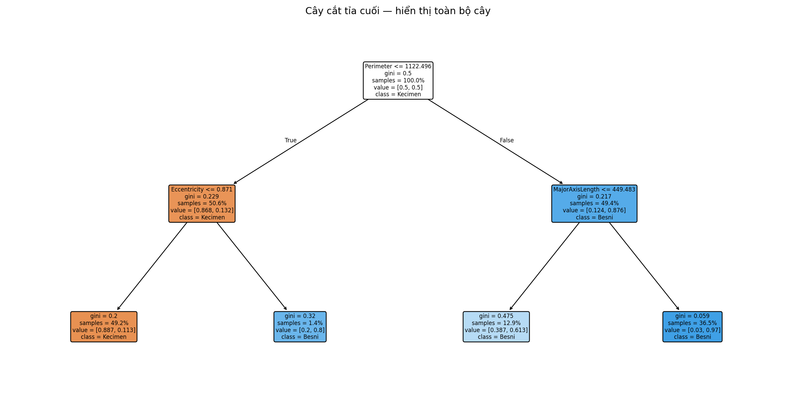

**Hình 11.** Cấu trúc đầy đủ của cây cắt tỉa được phục vụ.

Tầm quan trọng theo mức giảm tạp chất của cây tập trung vào `Perimeter` (0,8821), sau đó là `MajorAxisLength` (0,0773) và `Eccentricity` (0,0406); các biến còn lại không được dùng trong cây cuối. Kết quả này mô tả cách cây cụ thể đã phân chia dữ liệu train. Nó không chứng minh chu vi gây ra sự khác biệt giống, và các đặc trưng tương quan có thể chia sẻ hoặc thay thế vai trò của nhau.

---

# 8. PHÂN TÍCH LỖI

## 8.1. Tổng quan lỗi

Cây cắt tỉa dự đoán sai 29/180 mẫu, tương ứng tỷ lệ lỗi 16,11%. Trong đó 15 mẫu Kecimen bị dự đoán thành Besni và 14 mẫu Besni bị dự đoán thành Kecimen. Sự cân bằng này phù hợp với precision/recall gần nhau của hai lớp.

## 8.2. Lỗi theo nhóm diện tích

Các ngưỡng tứ phân vị của `Area` được học trên tập phát triển: 59.478; 78.902; 105.116,25 pixel².

| Nhóm Area trên test | Số mẫu | Số lỗi | Tỷ lệ lỗi |
|---|---:|---:|---:|
| `< 59.478` | 47 | 5 | 10,64% |
| `59.478 – < 78.902` | 43 | 10 | 23,26% |
| `78.902 – < 105.116,25` | 47 | 12 | 25,53% |
| `≥ 105.116,25` | 43 | 2 | 4,65% |

Lỗi tập trung nhiều hơn ở hai nhóm diện tích giữa. Một cách giải thích hợp lý là hai giống có vùng chồng lấn lớn hơn ở kích thước trung bình, trong khi các mẫu rất lớn hoặc rất nhỏ dễ phân biệt hơn. Đây chỉ là mô tả mối liên hệ trong tập test, không phải kết luận nhân quả.

## 8.3. Lỗi theo độ lệch tâm

Các ngưỡng tứ phân vị của `Eccentricity` trên tập phát triển là 0,74054; 0,79885; 0,84220.

| Nhóm Eccentricity trên test | Số mẫu | Số lỗi | Tỷ lệ lỗi |
|---|---:|---:|---:|
| `< 0,74054` | 41 | 5 | 12,20% |
| `0,74054 – < 0,79885` | 49 | 14 | 28,57% |
| `0,79885 – < 0,84220` | 44 | 8 | 18,18% |
| `≥ 0,84220` | 46 | 2 | 4,35% |

Nhóm độ lệch tâm thứ hai có tỷ lệ lỗi cao nhất. Các mẫu rất kéo dài, thuộc nhóm trên cùng, có tỷ lệ lỗi thấp nhất. Điều này gợi ý rằng vùng hình dạng trung gian khó phân loại hơn. Tuy nhiên số mẫu mỗi nhóm chỉ khoảng 41–49, nên tỷ lệ có thể biến động nếu thay đổi tập test.

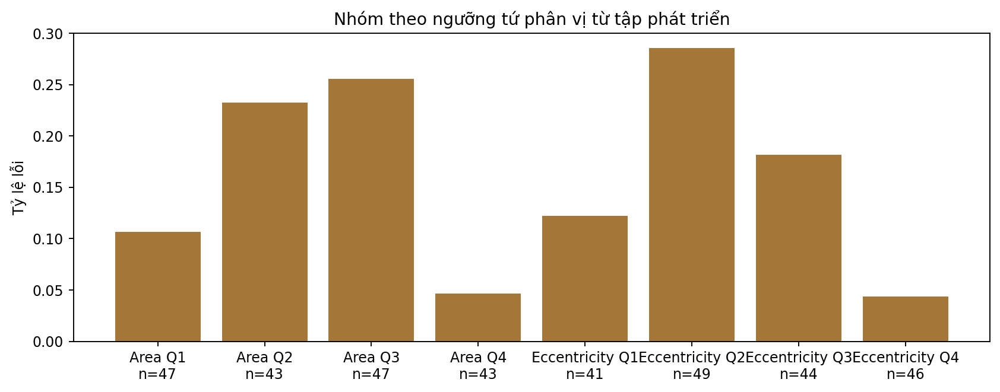

**Hình 12.** Tỷ lệ lỗi theo nhóm `Area` và `Eccentricity`.

## 8.4. Nguyên nhân có thể và biện pháp

Các nguyên nhân có thể gồm:

- hai giống thực sự có vùng hình dạng chồng lấn;
- bảy đặc trưng không chứa toàn bộ thông tin về bề mặt, màu sắc hoặc cấu trúc;
- mẫu chỉ đến từ một nguồn nên chưa mô tả hết biến thiên thực tế;
- tỷ lệ lớp tại lá chưa được hiệu chuẩn;
- thiếu ID lô khiến nhóm chưa đánh giá được ảnh hưởng giữa các lô sản xuất.

Các hướng cải thiện nên được kiểm chứng bằng dữ liệu mới, gồm thu thập ID lô, đánh giá theo group split, kiểm tra hiệu chuẩn xác suất, thêm cảnh báo ngoài miền và so sánh permutation importance. Không nên đơn giản tăng độ sâu vì kết quả E01 đã cho thấy cây sâu quá khớp.

---

# 9. THIẾT KẾ VÀ TRIỂN KHAI ỨNG DỤNG WEB/API

## 9.1. Kiến trúc hệ thống

Hệ thống tách rõ huấn luyện offline khỏi serving:

```text
Dữ liệu UCI
    ↓
Python: kiểm tra → chia tập → CV → huấn luyện → đánh giá
    ↓ xuất JSON + metadata + checksum
Node.js/Express: nạp mô hình một lần → validation → suy luận
    ↑ JSON                                      ↓ JSON
React + TypeScript: form/CSV → hiển thị kết quả và dashboard
```

Python chỉ chạy khi xây dựng hoặc tái tạo artifact. Backend không khởi động Python và không huấn luyện lại theo request. Kiến trúc này giúp ứng dụng triển khai gọn, đồng thời vẫn giữ pipeline nghiên cứu độc lập.

## 9.2. Công nghệ sử dụng

| Thành phần | Công nghệ | Vai trò |
|---|---|---|
| Học máy | Python, pandas, scikit-learn | Dữ liệu, CV, train, evaluate |
| Biểu đồ | Matplotlib | EDA và hình đánh giá |
| Frontend | React 19, TypeScript, Vite | Giao diện và xử lý CSV |
| Backend | Node.js, Express | API, validation, nạp model |
| Định dạng model | JSON | Cấu trúc cây, xác suất lá, metadata |
| Kiểm thử | `node:test`, Python `unittest` | API, validation và dữ liệu |

Dự án không cần cơ sở dữ liệu vì không có tài khoản, lịch sử dự đoán hoặc nghiệp vụ lưu trữ. Việc bỏ cơ sở dữ liệu làm giảm độ phức tạp và phù hợp phạm vi bài tập.

## 9.3. Ba màn hình chính

1. **Tổng quan:** giới thiệu bài toán, dữ liệu, phạm vi, mô hình và kết quả test chính.
2. **Phân loại:** nhập bảy số đo cho một mẫu hoặc tải CSV; hiển thị nhãn, xác suất và lỗi theo dòng/cột.
3. **Đánh giá:** hiển thị bảng so sánh, ma trận nhầm lẫn, biểu đồ thí nghiệm, chất lượng theo lớp và model card.

**[Chèn Hình 13: ảnh chụp màn hình Tổng quan của Raisin Lab]**

**[Chèn Hình 14: ảnh chụp màn hình Phân loại và kết quả một mẫu]**

**[Chèn Hình 15: ảnh chụp màn hình Dashboard đánh giá]**

Giao diện sử dụng ngôn ngữ thị giác gắn với chủ đề đo hình dạng: màu tím nho, xanh cuống, nền giấy kỹ thuật và minh họa trục lớn/trục nhỏ. Bố cục responsive đã được kiểm tra ở màn hình desktop và chiều rộng 375 px. Các thành phần form có label, trạng thái focus và cấu trúc heading phục vụ truy cập bàn phím.

## 9.4. API

Các endpoint chính:

| Phương thức | Endpoint | Chức năng |
|---|---|---|
| GET | `/api/health` | Trạng thái backend và model |
| GET | `/api/model` | Schema, phiên bản, metric và model card |
| POST | `/api/raisin-classify` | Phân loại từ 1 đến 1.000 dòng |

Ví dụ request:

```json
{
  "rows": [{
    "Area": 80000,
    "MajorAxisLength": 400,
    "MinorAxisLength": 260,
    "Eccentricity": 0.76,
    "ConvexArea": 82000,
    "Extent": 0.70,
    "Perimeter": 1100
  }]
}
```

Ví dụ response:

```json
{
  "modelVersion": "raisin-1-fe3677bd45ef",
  "count": 1,
  "predictions": [{
    "rowIndex": 0,
    "label": "Kecimen",
    "probabilities": {
      "Kecimen": 0.8870056497175142,
      "Besni": 0.11299435028248588
    }
  }]
}
```

## 9.5. Validation và xử lý lỗi

API kiểm tra `Content-Type`, kích thước body, số dòng, tên cột, kiểu số, tính hữu hạn, miền giá trị và các quan hệ hình học. Giới hạn hiện tại là 1 MB và tối đa 1.000 dòng. Nếu một dòng sai, toàn bộ lô bị từ chối và response chỉ rõ dòng/cột cần sửa; hệ thống không bỏ âm thầm hoặc thay giá trị bằng 0.

| Mã HTTP | Trường hợp |
|---:|---|
| 200 | Request hợp lệ và dự đoán thành công |
| 400 | JSON sai cú pháp |
| 404 | Endpoint không tồn tại |
| 413 | Body vượt 1 MB |
| 415 | Sai `Content-Type` |
| 422 | Thiếu/sai feature, cột lạ hoặc quá 1.000 dòng |
| 503 | Model thiếu, hỏng hoặc không sẵn sàng |

## 9.6. Nạp và xác minh mô hình

Backend đọc `models/serving.json` khi khởi động, kiểm schema, thứ tự bảy đặc trưng, phiên bản và SHA-256. Mỗi mẫu đi qua các nút của cây đến lá, sau đó backend trả phân bố lớp đã lưu ở lá. Cách biểu diễn JSON tránh thêm ONNX runtime hoặc chạy Python như một dịch vụ web, phù hợp vì mô hình cuối là cây nhỏ.

Model card công khai phiên bản `raisin-1-fe3677bd45ef`, dữ liệu/split, metric, quy tắc nhãn, phiên bản thư viện và các giới hạn. Vì vậy số liệu hiển thị trên dashboard gắn đúng với artifact đang phục vụ.

---

# 10. KIỂM THỬ, HIỆU NĂNG VÀ KHẢ NĂNG TÁI LẬP

## 10.1. Kiểm thử chức năng

Kiểm thử backend bao phủ health/model status, request hợp lệ, validation sai, giới hạn kích thước và tình huống model không sẵn sàng. Lần kiểm tra gần nhất có 6/6 test Node.js đạt. Frontend được biên dịch bằng TypeScript và Vite thành công. Luồng thực tế từ điền form đến nhận nhãn/xác suất đã được kiểm tra trên trình duyệt ở desktop và mobile.

## 10.2. Đối chiếu Python–Node.js

Để tránh sai khác do tự cài đặt lại thuật toán suy luận, nhóm tạo ca kiểm tra từ dữ liệu phát triển và các mẫu tổng hợp gần ngưỡng. Tập test không được dùng cho parity.

| Mô hình | Số ca | Mẫu phát triển | Mẫu tổng hợp | Lệch nhãn | Sai số xác suất lớn nhất |
|---|---:|---:|---:|---:|---:|
| Lớp phổ biến | 720 | 720 | 0 | 0 | 0 |
| Decision stump | 723 | 720 | 3 | 0 | 0 |
| Cây cắt tỉa | 729 | 720 | 9 | 0 | 0 |
| Random Forest | 1.020 | 720 | 300 | 0 | 0 |
| **Tổng** | **3.192** |  |  | **0** | **0** |

Ngưỡng sai số tuyệt đối cho phép là `10⁻⁶`. Kết quả cho thấy backend giữ nguyên nhãn, xác suất, thứ tự lớp và quy tắc ngưỡng so với pipeline Python.

## 10.3. Hiệu năng API

Phép đo cục bộ được thực hiện tuần tự qua HTTP trên máy AMD Ryzen 5 5500U, Windows x64, Node.js v24.13.0. Sau ba lượt warm-up, mỗi kích thước batch chạy 30 request.

| Kích thước lô | p95 | Nhỏ nhất | Lớn nhất |
|---:|---:|---:|---:|
| 1 mẫu | 4,84 ms | 2,29 ms | 4,84 ms |
| 1.000 mẫu | 11,52 ms | 7,98 ms | 32,81 ms |

Đây là phép đo trên máy phát triển, dùng mẫu hợp lệ lặp lại và không phải dữ liệu đánh giá độ chính xác. Kết quả cho thấy cây JSON nhỏ đủ nhanh cho demo và lô tối đa hiện tại; không dùng các số này để cam kết hiệu năng trên server khác.

## 10.4. Khả năng tái lập

Script `scripts/reproduce.py` đã chạy lại toàn bộ pipeline trong một thư mục dự án cô lập trên cùng máy và cùng môi trường đã cài. Kết quả xác nhận:

- split giống hệt;
- ứng viên được chọn giống hệt;
- mô hình phục vụ và tất cả JSON model giống hệt;
- metric test giống hệt;
- dự đoán test giống hệt.

Môi trường artifact chính thức gồm NumPy 2.3.5, pandas 2.3.3, scikit-learn 1.7.2, Matplotlib 3.10.7, openpyxl 3.1.5 và joblib 1.5.2. Dependency được khóa trong `requirements-lock.txt`.

Việc trên mới chứng minh khả năng lặp lại trong thư mục sạch trên cùng máy, chưa thay thế yêu cầu chạy trên một máy vật lý hoặc môi trường sạch khác. Trước khi nộp, nhóm cần clone repository trên máy thứ hai, cài dependency từ đầu, chạy download/train/evaluate/build/test và ghi lại hệ điều hành, phiên bản, thời gian cùng checksum kết quả tại Phụ lục D.

---

# 11. SỬ DỤNG CÓ TRÁCH NHIỆM VÀ GIỚI HẠN

## 11.1. Giới hạn dữ liệu

- Bộ dữ liệu chỉ có 900 mẫu từ một nguồn; chưa chắc đại diện mọi vùng trồng, điều kiện sấy, camera hoặc dây chuyền.
- Không có ảnh thô nên không kiểm tra được chất lượng phân đoạn và trích đặc trưng.
- Không có ID quả/lô; dù không có vector đặc trưng trùng, vẫn không thể loại trừ mọi phụ thuộc giữa mẫu.
- Đơn vị là pixel và phụ thuộc quy trình chụp; dữ liệu từ hệ thống khác phải dùng cách trích đặc trưng và thang đo tương thích.

## 11.2. Giới hạn mô hình

- Mô hình chỉ phân biệt Kecimen và Besni; một giống khác vẫn bị ép vào một trong hai lớp.
- Chưa có cảnh báo ngoài phân phối. Một mẫu hợp lệ về schema nhưng khác xa dữ liệu train vẫn nhận dự đoán.
- Xác suất từ tỷ lệ lớp tại lá chưa được hiệu chuẩn.
- Metric trên 180 mẫu test có độ không chắc chắn; không nên coi 83,89% là mức bảo đảm cố định.
- Tầm quan trọng theo cây phản ánh giảm tạp chất trên train và không chứng minh quan hệ nhân quả.

## 11.3. Nguyên tắc sử dụng

Ứng dụng chỉ hỗ trợ sàng lọc. Không dùng một dự đoán để tự động loại sản phẩm hoặc đánh giá nhà cung cấp. Người sử dụng cần giữ thông tin về thiết bị chụp, cách trích đặc trưng và lô sản xuất; theo dõi tỷ lệ lỗi trên dữ liệu mới; dừng sử dụng nếu miền dữ liệu thay đổi đáng kể. Các quyết định có tác động kinh tế cần có quy trình kiểm tra thủ công và đánh giá định kỳ.

## 11.4. Minh bạch về công cụ AI

Trong quá trình thực hiện, công cụ AI được dùng để hỗ trợ lập kế hoạch, rà soát yêu cầu, gợi ý cấu trúc mã/tài liệu và chỉnh sửa cách trình bày giao diện. Nhóm không lấy kết quả AI làm bằng chứng thực nghiệm. Mọi con số trong báo cáo được đối chiếu với artifact do pipeline chạy; mã nguồn được kiểm tra bằng test, parity Python–Node và chạy lại trong thư mục cô lập. Hai thành viên chịu trách nhiệm hiểu, kiểm tra và giải thích toàn bộ nội dung khi vấn đáp.

---

# 12. KẾT LUẬN VÀ HƯỚNG PHÁT TRIỂN

Đề tài đã hoàn thành một quy trình phân loại hai giống nho khô từ bảy đặc trưng hình học, bao gồm quản trị dữ liệu, baseline, cây quyết định, cắt tỉa, Random Forest, nhiều seed, test độc lập, phân tích lỗi và tích hợp web. Việc chia dữ liệu và lựa chọn mô hình được khóa trước khi mở test, nhờ đó kết quả cuối không được dùng ngược lại để tinh chỉnh.

Mô hình cây cắt tỉa `ccp_alpha = 0,01` đạt Accuracy 83,89%, F1-macro 0,8389 và ROC-AUC 0,8741 trên test. Mô hình vượt rõ baseline lớp phổ biến và nhỉnh hơn stump. Random Forest đạt AUC cao hơn nhưng không cải thiện F1-macro, có chênh lệch train–test lớn hơn và phức tạp hơn. Vì vậy cây cắt tỉa là lựa chọn phù hợp với tiêu chí F1, tính giải thích và phạm vi triển khai.

Kết quả thực nghiệm trả lời câu hỏi nghiên cứu như sau: các quy tắc cây có khả năng tổng quát trên test; cây sâu tự do quá khớp; cắt tỉa mạnh ở mức phù hợp giúp giảm độ phức tạp và tăng validation; Random Forest cải thiện khả năng xếp hạng xác suất nhưng không tạo cải thiện F1 rõ ràng. Việc chuyển mô hình sang Node.js thành công với 3.192 ca parity không sai khác.

Hướng phát triển ưu tiên là đánh giá trên máy và dữ liệu ngoài nguồn hiện tại, bổ sung ID lô để chia theo nhóm, hiệu chuẩn xác suất, phát hiện mẫu ngoài miền và theo dõi drift. Sau khi phần bắt buộc được xác nhận, có thể so sánh permutation importance với tầm quan trọng theo cây. Không nên mở rộng tính năng trước khi có dữ liệu thực tế và tiêu chí nghiệp vụ rõ ràng.

---

# TÀI LIỆU THAM KHẢO

[1] Nguyễn Văn Hậu, *Bài 6 — Cây quyết định, cắt tỉa và rừng ngẫu nhiên*, slide học phần Học máy cơ bản, 2026.

[2] Çinar, İ., Koklu, M., & Tasdemir, S. (2020). *Raisin [Dataset].* UCI Machine Learning Repository. https://doi.org/10.24432/C5660T

[3] Cinar, I., Koklu, M., & Tasdemir, S. (2020). *Classification of Raisin Grains Using Machine Vision and Artificial Intelligence Methods.* Gazi Journal of Engineering Sciences, 6(3), 200–209. https://doi.org/10.30855/gmbd.2020.03.03

[4] Breiman, L., Friedman, J. H., Olshen, R. A., & Stone, C. J. (1984). *Classification and Regression Trees.* Wadsworth.

[5] Breiman, L. (2001). Random Forests. *Machine Learning*, 45, 5–32. https://doi.org/10.1023/A:1010933404324

[6] Scikit-learn developers. *Decision Trees — User Guide.* https://scikit-learn.org/stable/modules/tree.html

[7] Scikit-learn developers. *RandomForestClassifier API Reference.* https://scikit-learn.org/stable/modules/generated/sklearn.ensemble.RandomForestClassifier.html

[8] Creative Commons. *Attribution 4.0 International (CC BY 4.0).* https://creativecommons.org/licenses/by/4.0/

---

# PHỤ LỤC A. HƯỚNG DẪN TÁI LẬP

## A.1. Yêu cầu môi trường

- Git;
- Node.js 22.12 trở lên;
- Python 3.11 hoặc 3.12;
- kết nối mạng cho lần tải dữ liệu đầu tiên;
- hai cổng 5173 và 3001 còn trống khi chạy dev.

## A.2. Cài đặt frontend/backend

```sh
git clone https://github.com/Thuanzz05/Machine_Learning_PhanLoaiHatNhoKho.git
cd Machine_Learning_PhanLoaiHatNhoKho
npm ci
npm run build
npm test
```

Chạy bản phát triển:

```sh
npm run dev
```

Web chạy tại `http://127.0.0.1:5173`; health API tại `http://127.0.0.1:3001/api/health`.

## A.3. Tái tạo pipeline học máy

```sh
python -m venv .venv
.venv\Scripts\python -m pip install -r requirements-lock.txt
.venv\Scripts\python ml/download_data.py
.venv\Scripts\python ml/data.py
.venv\Scripts\python ml/train.py
.venv\Scripts\python ml/check_parity.py
node scripts/check-parity.mjs
.venv\Scripts\python ml/evaluate.py
.venv\Scripts\python -m unittest discover -s ml -p "test_*.py" -v
```

Tái lập trong thư mục cô lập:

```sh
.venv\Scripts\python scripts/reproduce.py
```

## A.4. Các tệp cần đối chiếu

- `data/source_manifest.json`: nguồn và checksum;
- `data/splits.json`: split/fold;
- `reports/data_quality.json`: chất lượng dữ liệu;
- `reports/cv_summary.json`: kết quả CV;
- `models/selection_lock.json`: khóa lựa chọn;
- `reports/evaluation.json`: kết quả test;
- `reports/parity.json`: đối chiếu Python–Node;
- `reports/reproduction.json`: kiểm tra tái lập;
- `models/metadata.json`: model card đang phục vụ.

---

# PHỤ LỤC B. CHECKLIST NGHIỆM THU

| Nội dung | Trạng thái | Minh chứng |
|---|---|---|
| Nguồn, giấy phép, checksum | Đạt | `data/README.md`, `source_manifest.json` |
| Data dictionary | Đạt | `data/DATA_DICTIONARY.md` |
| Kiểm tra chất lượng | Đạt | `reports/data_quality.json` |
| Split độc lập, không leakage | Đạt | `ml/protocol.json`, `data/splits.json` |
| Hai baseline | Đạt | `reports/cv_summary.json` |
| E01–E04 | Đạt | `reports/figures/`, `cv_summary.json` |
| Test cuối và phân tích lỗi | Đạt | `reports/evaluation.json` |
| Web/API ba màn hình | Đạt | `frontend/`, `backend/` |
| Parity Python–Node | Đạt | `reports/parity.json` |
| Build và test Node | Đạt | `npm run build`, `npm test` |
| Tái lập thư mục sạch cùng máy | Đạt | `reports/reproduction.json` |
| Tái lập trên máy khác | **Chưa xác nhận** | Điền Phụ lục D |
| Báo cáo/slide/nhật ký | Đang hoàn thiện | Hồ sơ nộp |

---

# PHỤ LỤC C. PHÂN CÔNG VÀ NHẬT KÝ

## C.1. Bảng phân công

> Hai thành viên cần thay nội dung mẫu bên dưới bằng công việc thực tế và liên kết commit/PR tương ứng. Mỗi người phải có đóng góp ở cả dữ liệu/mô hình và web/báo cáo.

| Hạng mục | Thành viên 1 | Thành viên 2 | Minh chứng commit/PR |
|---|---|---|---|
| Hồ sơ dữ liệu và kiểm tra chất lượng | [Điền] | [Điền] | [Điền] |
| Baseline và cây quyết định | [Điền] | [Điền] | [Điền] |
| Random Forest và phân tích lỗi | [Điền] | [Điền] | [Điền] |
| Backend, model parity | [Điền] | [Điền] | [Điền] |
| Frontend và dashboard | [Điền] | [Điền] | [Điền] |
| Báo cáo, slide và demo | [Điền] | [Điền] | [Điền] |

## C.2. Nhật ký sáu tuần

| Tuần | Người thực hiện | Công việc | Giờ dự kiến | Giờ thực tế | Kết quả/vấn đề | Commit/PR |
|---|---|---|---:|---:|---|---|
| T1 | [Điền] | Chốt bài toán, schema, tiêu chí | [ ] | [ ] | [Điền] | [Điền] |
| T2 | [Điền] | Dữ liệu, chất lượng, split, EDA | [ ] | [ ] | [Điền] | [Điền] |
| T3 | [Điền] | Baseline, cây, pruning, forest | [ ] | [ ] | [Điền] | [Điền] |
| T4 | [Điền] | Khóa mô hình, test, phân tích lỗi | [ ] | [ ] | [Điền] | [Điền] |
| T5 | [Điền] | API, parity, frontend/dashboard | [ ] | [ ] | [Điền] | [Điền] |
| T6 | [Điền] | Tái lập, báo cáo, slide, luyện demo | [ ] | [ ] | [Điền] | [Điền] |

---

# PHỤ LỤC D. BIÊN BẢN CHẠY TRÊN MÁY SẠCH KHÁC

| Thông tin | Kết quả |
|---|---|
| Người thực hiện | [Điền] |
| Ngày giờ | [Điền] |
| Hệ điều hành/CPU | [Điền] |
| Phiên bản Git/Node/Python | [Điền] |
| Commit đã checkout | [Điền] |
| `npm ci` | [Đạt/Không đạt + log] |
| `npm run build` | [Đạt/Không đạt + log] |
| `npm test` | [Đạt/Không đạt + log] |
| Tải và checksum dữ liệu | [Điền] |
| Pipeline Python | [Đạt/Không đạt + log] |
| Model/checksum giống bản khóa | [Điền] |
| Metric test giống bản khóa | [Điền] |
| Parity Python–Node | [Điền] |
| Kết luận | [Điền] |

---

# PHỤ LỤC E. CÂU HỎI VẤN ĐÁP GỢI Ý

1. **Vì sao cần nhiều seed với 900 mẫu?**  
   Vì dữ liệu nhỏ khiến thành phần các fold có thể làm điểm dao động. Nhiều seed giúp đánh giá độ ổn định và tránh chọn theo một lần chia thuận lợi.

2. **Vì sao không dùng test để chọn `ccp_alpha`?**  
   Nếu dùng test để chọn tham số, test trở thành validation và không còn ước lượng độc lập cho khả năng tổng quát.

3. **Chênh lệch train–test cho biết gì?**  
   Khoảng cách lớn là tín hiệu mô hình học quá sát train hoặc dữ liệu giữa hai tập khác nhau. Nó không tự chứng minh nguyên nhân, nhưng cần được phân tích cùng độ phức tạp và CV.

4. **Tăng số cây có luôn giải quyết overfit không?**  
   Không. Tăng cây chủ yếu giảm phương sai của trung bình nếu các cây chưa tương quan hoàn toàn; thiên lệch, dữ liệu và cấu hình mỗi cây vẫn giới hạn kết quả.

5. **Vì sao cây cắt tỉa được chọn dù Random Forest có AUC test cao hơn?**  
   Quy tắc chọn dùng F1-macro CV và đã khóa trước test. Đổi mô hình sau khi xem AUC test sẽ làm rò rỉ quyết định. Cây cũng có gap nhỏ hơn và dễ giải thích hơn.

6. **Xác suất 0,89 có phải dự đoán chắc chắn đúng 89% không?**  
   Không. Đây là xác suất từ phân bố lớp tại lá, chưa được hiệu chuẩn và không phải cam kết cho một mẫu riêng lẻ.

7. **Tại sao không chuẩn hóa dữ liệu?**  
   Cây quyết định chọn ngưỡng theo thứ tự giá trị và không dùng khoảng cách Euclid; dữ liệu cũng không thiếu. Không chuẩn hóa làm pipeline đơn giản hơn mà không mất yêu cầu của mô hình.

8. **Feature importance có chứng minh chu vi quyết định giống không?**  
   Không. Nó chỉ phản ánh tổng mức giảm tạp chất do cây tạo trên dữ liệu train; tương quan giữa các biến và lựa chọn của mô hình có thể làm thay đổi importance.

9. **Làm sao biết Node.js suy luận giống Python?**  
   Dự án đối chiếu 3.192 trường hợp, gồm dữ liệu phát triển và mẫu tổng hợp gần ngưỡng, với tolerance `10⁻⁶`; không có lệch nhãn hoặc xác suất.

10. **Hạn chế quan trọng nhất khi đưa vào dây chuyền là gì?**  
    Chưa có dữ liệu ngoài nguồn hiện tại, chưa kiểm soát khác biệt thiết bị/trích đặc trưng và chưa có cảnh báo ngoài miền. Vì vậy hệ thống chỉ nên hỗ trợ sàng lọc.
