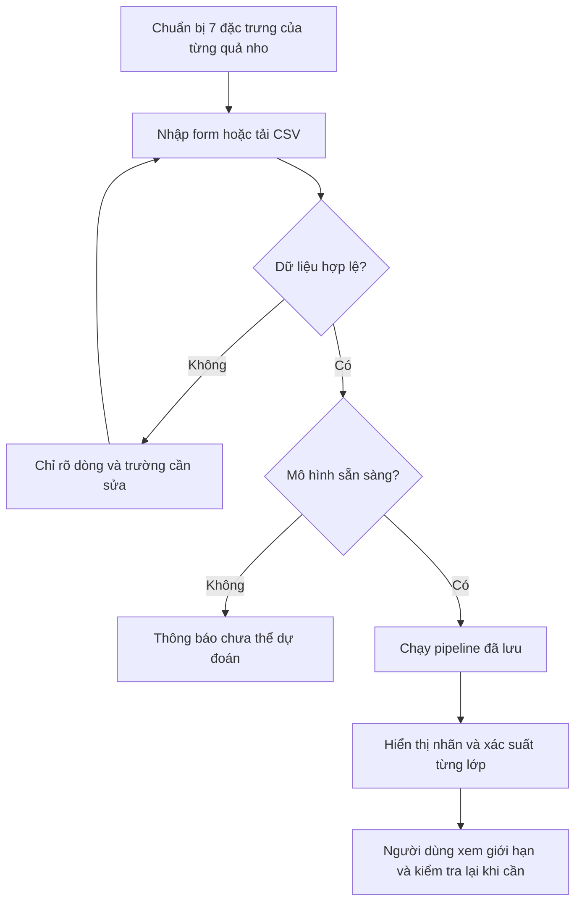

# Kế hoạch phân tích nghiệp vụ và yêu cầu dự án phân loại giống nho khô

**Project 18 · Học máy cơ bản · Lớp 12523W.1**  
**Giảng viên:** PGS.TS. Nguyễn Văn Hậu  
**Ngày lập:** 29/09/2026 · **Phiên bản:** 1.1, đã bổ sung GitHub Bài 6 v3  
**Đối tượng sử dụng:** Nhóm 02 sinh viên thực hiện dự án trong 06 tuần.

## 1 Mục đích và kết luận từ việc đọc tài liệu

Tài liệu này chuyển đề giao nhiệm vụ, bài giảng và hiện trạng mã nguồn thành một kế hoạch thực hiện có thể kiểm tra. Nhóm cần xây dựng hệ thống hỗ trợ phân loại **Kecimen hoặc Besni từ 7 đặc trưng hình học đã được trích xuất**, có xác suất dự đoán, thí nghiệm học máy trung thực và ứng dụng web chạy local.

Trọng tâm là chứng minh cây quyết định tổng quát hóa ra sao, cắt tỉa tác động thế nào và Random Forest cải thiện bao nhiêu so với baseline. Website là nơi sử dụng và trình bày mô hình đã đánh giá; chất lượng giao diện không thay thế bằng chứng thực nghiệm.

**Hiện trạng:** Có khung React + TypeScript và Node.js + Express, ba màn hình, đọc CSV, kiểm tra đầu vào và bộ kiểm thử API. Chưa có dữ liệu Raisin thật trong thư mục, script học máy, mô hình đã huấn luyện hay kết quả đánh giá. API hiện trả `503 MODEL_NOT_READY` sau khi kiểm tra đầu vào hợp lệ. Nhận định này dựa trên đọc mã nguồn, không phải kết quả chạy lại ứng dụng trong lần lập kế hoạch.

**Thứ tự ưu tiên:** Chốt yêu cầu và giao thức đánh giá → dữ liệu và baseline → bốn thí nghiệm → khóa mô hình và đánh giá test → tích hợp dự đoán thật → báo cáo, demo và tái lập.

### Cách đọc các yêu cầu

- **Bắt buộc theo đề:** Điều kiện lấy trực tiếp từ tài liệu Project 18, ký hiệu nguồn S01.
- **Kế thừa hiện trạng:** Lựa chọn đang có trong mã nguồn, không tự coi là quy định của giảng viên.
- **Đề xuất thực hiện:** Cách tổ chức cụ thể để làm bài; cần ghi vào cấu hình/biên bản trước thí nghiệm, không trình bày như yêu cầu nguyên văn của đề.
- **Tùy chọn:** Chỉ làm sau khi hoàn thành các phần bắt buộc.

Tài liệu là kế hoạch và đặc tả dự kiến, chưa phải báo cáo kết quả. Mọi Accuracy, F1, ROC-AUC, thời gian chạy và mức cải thiện phải được điền từ lần chạy thật.

## 2 Nguồn đã đọc và nguyên tắc đối chiếu

### 2.1 Hồ sơ nguồn

Đã rà soát **91 tệp ngoài thư mục quản lý Git**, gồm 67 ảnh bài giảng, 03 tài liệu Word/PDF và 21 tệp ghi chú, mã nguồn, cấu hình, dữ liệu mẫu. Các tệp sinh tự động như `package-lock.json` được phân tích cấu trúc và phiên bản phụ thuộc; không coi chúng là yêu cầu nghiệp vụ.

| Mã | Nguồn | Phạm vi đọc và vai trò |
|---|---|---|
| S01 | `Project_18_phan_loai_hat_nho_kho.docx` | Toàn bộ nội dung, bảng, đầu/chân trang. Nguồn quyết định phạm vi, đầu ra, thí nghiệm, lịch 6 tuần, rubric và điều kiện nộp. |
| S02 | `Bai06_Kien_thuc_nen_tang_va_doc_truoc.pdf` | Đủ 12 trang, gồm phụ lục A và B; kiểm tra trực quan các trang công thức Gini/cắt tỉa. Nền tảng về cây và đánh giá. |
| S03 | `HocMayCoBan_Tap-chuan-bi-truoc-buoi-hoc.pdf` | Đủ 26 trang, gồm 10 buổi, phụ lục kết quả và thuật ngữ. Bài 3, 6, 7 liên quan trực tiếp nhất. |
| S04 | `Images_bai_giang/` | Xem đủ 67 ảnh hiện có. Có 62 số trang slide khác nhau trong bộ đánh số 1–68, một ảnh lặp trang 8 và bốn ảnh tổng kết. |
| S05 | `GHI_NHO_BAI_GIANG.md` | Đọc toàn bộ và đối chiếu với ảnh/PDF; dùng làm chỉ mục tra cứu, không thay đề gốc. |
| S06 | `README.md`, `docs/KE_HOACH.md`, `data/README.md`, `ml/README.md` | Phạm vi khung ứng dụng, checklist cũ và những việc chưa triển khai. |
| S07 | Mã nguồn, schema, cấu hình, test, CSV mẫu | Xác định chức năng thực sự đã có và khoảng trống cần hoàn thiện; danh mục ở mục 16. |
| S08 | [Trang Raisin tại UCI](https://archive.ics.uci.edu/dataset/850/raisin) | Đối chiếu mô tả nguồn ngày 29/09/2026; chưa tải bộ dữ liệu để kiểm đếm trực tiếp. |
| S09 | [scikit-learn 1.7 về leakage](https://scikit-learn.org/1.7/common_pitfalls.html), [cây quyết định](https://scikit-learn.org/1.7/modules/tree.html) | Kiểm tra nguyên tắc Pipeline và tài liệu đúng nhánh phiên bản đang ghi trong `requirements.txt`. |
| S10 | [GitHub readings/bai06](https://github.com/ml4vn/MachineLearning/tree/9bcedc90cffdf0102df3151e92e7ffbed24a8f2a/readings/bai06) | Đọc bản v3, đối chiếu Markdown/Word/JSON, PDF 15 trang, sáu hình, công thức, policy và các CSV. Kiểm mã Git blob của đủ 40 tệp; đọc toàn bộ hai CSV dự đoán bằng chương trình để kiểm đếm và tính lại metric. |
| S11 | [GitHub lessons/bai06](https://github.com/ml4vn/MachineLearning/tree/9bcedc90cffdf0102df3151e92e7ffbed24a8f2a/lessons/bai06), [quy ước đối chiếu học liệu](https://github.com/ml4vn/MachineLearning/blob/9bcedc90cffdf0102df3151e92e7ffbed24a8f2a/docs/DOI_CHIEU_HOC_LIEU.md) | Đọc thêm 09 tệp trong thư mục thực hành và 01 tài liệu đối chiếu được liên kết từ bài đọc. Đọc mã minh họa và kiểm thử; chưa chạy lại toàn bộ pipeline Olist. |

**Giới hạn nguồn:** Không thấy ảnh riêng cho các slide **6, 16, 20, 24, 57, 60**. Một số ảnh chụp bị nghiêng/cắt mép. Không tự dựng lại nội dung bị thiếu. Các hiện vật được slide nhắc như `tree_lab.py`, `case_audit.json`, `Bai06_Du_lieu_that.html` không có trong thư mục hiện tại; không ghi nhận là đã đọc hay chạy chúng.

### 2.2 Những điểm phải hiểu đúng trước khi làm

1. **Không lẫn bộ dữ liệu.** S03 minh họa Bài 6 bằng Dry Bean; S02 và S04 minh họa bằng Olist. S01 giao bài Raisin. Chỉ dùng nguyên lý từ bài giảng; không dùng số mẫu, ngưỡng, tham số hay điểm số của Olist/Dry Bean làm kết quả Raisin.
2. **Cắt tỉa là bắt buộc trong dự án.** Dù phụ lục B của S02 là nội dung đọc mở rộng, S01 mục 3 yêu cầu cây cắt tỉa và thí nghiệm `ccp_alpha`.
3. **Đầu vào không phải ảnh thô.** Không phải xây camera, tách nền hay mạng nhận dạng ảnh. Đề đã cho 7 đặc trưng được trích từ ảnh.
4. **Framework backend là khuyến nghị.** S01 gợi ý Flask/FastAPI; khung hiện tại dùng Node.js. Kế hoạch giữ Node.js, Python huấn luyện offline và chứng minh kết quả suy luận thống nhất giữa hai môi trường.
5. **Không có ngưỡng Accuracy bắt buộc như 90% hay 95%.** Tiêu chí tối thiểu là tái lập, đánh giá không rò rỉ và vượt baseline hoặc giải thích rõ vì sao không vượt [S01 mục 1].
6. **Xác suất không phải bảo đảm đúng.** Điểm tại lá, ngưỡng ra nhãn và độ chính xác toàn bộ tập là ba khái niệm khác nhau. Không ghi “chắc chắn đúng 95%” chỉ vì mô hình trả điểm 0,95 [S02 trang 4, 8; S04 slide 49].
7. **Không sao chép kết luận tổng quát quá mức.** Cây không cần chuẩn hóa kiểu khoảng cách Euclid; điều đó không chứng minh mọi phép biến đổi phi tuyến đều giữ nguyên dự đoán mới [S02 trang 12; S04 slide 64].
8. **Đối chiếu từ điển dữ liệu cẩn thận.** Trang UCI hiện có mô tả ở một số dòng của bảng biến không khớp với phần “Additional Variable Information”. Khi làm data dictionary, đối chiếu phần mô tả bổ sung và tài liệu đi cùng dữ liệu; không sao chép nhầm diễn giải Perimeter sang MajorAxisLength [S08].

### 2.3 Bổ sung từ đường dẫn GitHub người dùng cung cấp

Đã đọc bản tại commit **`9bcedc90cffdf0102df3151e92e7ffbed24a8f2a`**, ngày 29/09/2026. Bản v3 có **15 trang**, bổ sung lộ trình, mục CART/cắt tỉa và giải thích AP; bản PDF cục bộ có 12 trang. Các mốc slide v3 là 20, 31, 46, 67; không dùng chúng thay số trang trên bộ ảnh cục bộ đánh số đến 68. [Nguồn bài đọc v3](https://github.com/ml4vn/MachineLearning/blob/9bcedc90cffdf0102df3151e92e7ffbed24a8f2a/readings/bai06/README.md).

Các thay đổi áp dụng vào kế hoạch:

- Bổ sung kiểm thử trường hợp **hai lớp cùng xác suất 0,5**. `predict` của thư viện và quy tắc `p >= 0,5` có thể trả nhãn khác; Python và Node phải dùng chung một chính sách.
- Giữ ngưỡng và số liệu đầy đủ trong artifact; chỉ làm tròn khi trình bày. Kiểm cả mẫu sát ngưỡng khi chuyển mô hình sang Node, vì kiểu số của lúc suy luận có thể ảnh hưởng nhánh đi.
- Phân biệt AP với Accuracy và ROC-AUC; AP bổ sung kiến thức đọc bài giảng, không thay ba metric bắt buộc của Project 18.
- Mã minh họa Olist dùng dừng sớm cho cây thật; không được gọi đó là đã hoàn thành thí nghiệm pruning của Raisin. Mã này cũng không thay phần Random Forest 50/100/300 cây của dự án.
- Hướng dẫn thực hành cơ bản coi nhiều seed là phần mở rộng tùy bài; Project 18 vẫn bắt buộc ít nhất 5 seed. [Nguồn thực hành](https://github.com/ml4vn/MachineLearning/blob/9bcedc90cffdf0102df3151e92e7ffbed24a8f2a/lessons/bai06/README.md), [lộ trình v3](https://github.com/ml4vn/MachineLearning/blob/9bcedc90cffdf0102df3151e92e7ffbed24a8f2a/lessons/bai06/HUONG_DAN_V3.md).

**Kiểm tra độc lập đã làm trên CSV tham chiếu:** Đếm được 10.389 dòng validation và 40.266 dòng test. Tính lại từ cột nhãn/điểm cho AP validation ≈ 0,100478; với ngưỡng 0,10, test có TN/FP/FN/TP = 34.659/2.129/3.046/432 và chi phí giả định 17.359, khớp các mốc chính. Đây chỉ là kiểm tra dữ liệu dự đoán đã lưu, **không phải huấn luyện lại Olist, không phải kết quả Raisin và không tạo ra test độc lập mới**. [CSV validation](https://github.com/ml4vn/MachineLearning/blob/9bcedc90cffdf0102df3151e92e7ffbed24a8f2a/readings/bai06/validation_predictions.csv), [CSV test](https://github.com/ml4vn/MachineLearning/blob/9bcedc90cffdf0102df3151e92e7ffbed24a8f2a/readings/bai06/test_predictions.csv), [policy tham chiếu](https://github.com/ml4vn/MachineLearning/blob/9bcedc90cffdf0102df3151e92e7ffbed24a8f2a/readings/bai06/model_policy.json).

## 3 Phân tích bài toán nghiệp vụ

### 3.1 Bối cảnh và vấn đề

Theo đề, một dây chuyền đóng gói cần hỗ trợ phân loại hai giống nho khô dựa trên hình dạng. Hệ thống cung cấp dự đoán để người vận hành tham khảo và kiểm tra lại, không tự điều khiển việc loại sản phẩm.

Chưa có khảo sát doanh nghiệp thực tế, quy trình đo cụ thể, số liệu năng suất hay chi phí nhầm lẫn. Vì vậy, quy trình nghiệp vụ dưới đây là **mô hình hóa tình huống trong đề**, không phải mô tả một doanh nghiệp đã được phỏng vấn.

### 3.2 Mục tiêu và câu hỏi cần trả lời

- **NV01 — Hỗ trợ nhận diện giống:** Với một mẫu đủ 7 số đo hợp lệ, cung cấp nhãn Kecimen/Besni và điểm xác suất của hai lớp.
- **NV02 — Hỗ trợ xử lý nhiều mẫu:** Nhập CSV, phát hiện dữ liệu sai và trả kết quả theo đúng thứ tự mẫu.
- **NV03 — Cho phép đánh giá độ tin cậy của hệ thống:** Trình bày nguồn dữ liệu, cách chia tập, các chỉ số thật, lỗi điển hình và giới hạn sử dụng.
- **NV04 — Trả lời câu hỏi nghiên cứu:** Cây có tổng quát trên dữ liệu chưa học không? Cắt tỉa thay đổi độ phức tạp và sai số thế nào? Rừng cải thiện bao nhiêu và có ổn định qua seed không?
- **NV05 — Bàn giao được:** Một người khác có thể tái tạo dữ liệu, huấn luyện, đánh giá và chạy web theo hướng dẫn.

Không đặt mục tiêu tiết kiệm tiền, giảm nhân sự hoặc tăng năng suất theo phần trăm khi chưa có phép đo nghiệp vụ.

### 3.3 Các bên liên quan

| Bên liên quan | Nhu cầu | Trách nhiệm/giới hạn |
|---|---|---|
| Người thao tác phân loại | Nhập số đo hoặc CSV, hiểu kết quả và lỗi đầu vào | Cung cấp số đo đúng điều kiện; kiểm tra lại kết quả trước quyết định thực tế. |
| Người xem đánh giá/giảng viên | Kiểm chứng mô hình, kết quả và khả năng giải thích | Đọc dashboard, báo cáo, chạy lại pipeline, vấn đáp từng thành viên. |
| Thành viên A và B | Thực hiện và hiểu toàn bộ dự án | Cùng tham gia dữ liệu/mô hình lẫn web/báo cáo; có minh chứng đóng góp. |
| Người chuẩn bị dữ liệu/mô hình | Tải dữ liệu, kiểm tra chất lượng, chạy thí nghiệm, xuất artifact | Là vai trò làm việc offline của nhóm; chưa cần tài khoản quản trị trên web. |

### 3.4 Quy trình hiện tại và quy trình mục tiêu

**Hiện tại trong khung phần mềm:** Người dùng nhập số/CSV → giao diện và API kiểm tra hợp lệ → API báo chưa có mô hình. Chưa có luồng dự đoán hoàn chỉnh.

**Quy trình mục tiêu:**



Huấn luyện và chọn mô hình là quy trình offline riêng: dữ liệu gốc → kiểm tra → chia tập → EDA trên train → baseline/thí nghiệm → chốt cấu hình → đánh giá cuối → lưu mô hình và hồ sơ → ứng dụng nạp mô hình.

### 3.5 Quy tắc nghiệp vụ

- **BR01:** Một dòng tương ứng một quả nho khô; không suy diễn một dòng thành một lô hàng.
- **BR02:** Chỉ nhận 7 đặc trưng trong schema dự đoán; `Class` chỉ là nhãn để học/đánh giá offline.
- **BR03:** Chỉ trả hai lớp thuộc phạm vi mô hình; không coi một giống ngoài phạm vi là chắc chắn Kecimen/Besni.
- **BR04:** Thiếu trường, sai kiểu hoặc vi phạm miền hợp lệ phải thông báo; không âm thầm điền 0, cắt ngưỡng hay đổi đơn vị.
- **BR05:** Kết quả giữ liên kết với dòng đầu vào; CSV có dòng sai thì trả lỗi cả lô theo thiết kế hiện tại, tránh người dùng tưởng mọi dòng đã được xử lý.
- **BR06:** Xác suất hiển thị phải đến từ artifact thực; chưa có mô hình thì không tạo nhãn hoặc số liệu minh họa mang dáng vẻ kết quả thật.
- **BR07:** Người dùng giữ quyết định cuối; không tự động loại sản phẩm [S01 mục 6].
- **BR08:** CSV người dùng tải lên không tự trở thành dữ liệu huấn luyện hoặc tập đánh giá. Không cần lưu lịch sử dự đoán trong phạm vi tối thiểu.

## 4 Phạm vi và thứ tự ưu tiên

### 4.1 Phần bắt buộc

- Bộ Raisin, hồ sơ nguồn/giấy phép, script tải và làm sạch, từ điển dữ liệu, báo cáo chất lượng.
- Stratified split phù hợp; chống rò rỉ; baseline lớp phổ biến và decision stump.
- Decision Tree có cắt tỉa; Random Forest có giới hạn độ sâu/lá.
- Đủ bốn thí nghiệm: độ sâu; pruning path/`ccp_alpha`; 50/100/300 cây; ít nhất 5 seed.
- Accuracy, F1, ROC-AUC, chênh lệch train–test, ma trận nhầm lẫn và phân tích lỗi.
- Web ít nhất ba màn hình, form/CSV/biểu đồ phân bố, API JSON, validation, model card, nhãn và mức tin cậy.
- Mã nguồn tái lập; mô hình/config; báo cáo 15–25 trang; slide, demo và hồ sơ làm việc nhóm.

### 4.2 Tùy chọn sau khi hoàn thành phần bắt buộc

- Phát hiện mẫu ngoài miền dữ liệu đã học, hoặc so sánh permutation importance với MDI [S01 mục 4].
- Xuất kết quả CSV, hiển thị đường đi của một mẫu qua cây trên web, thêm bộ lọc xem lỗi: tiện ích đề xuất, không phải điều kiện giao đề.

### 4.3 Ngoài phạm vi phiên bản nộp tối thiểu

Camera/ảnh đầu vào, xử lý ảnh thô, deep learning, ứng dụng di động, cloud, tài khoản/phân quyền, quản lý kho, thanh toán, cơ sở dữ liệu và tự huấn luyện lại từ CSV người dùng. Không bổ sung các phần này nếu làm chậm thí nghiệm hoặc bàn giao.

## 5 Yêu cầu dữ liệu

### 5.1 Nguồn và hợp đồng dữ liệu

S01 và trang UCI mô tả 900 mẫu, 7 đặc trưng, hai lớp cân bằng. Đây là **thông tin nguồn**, chưa phải số lượng đã kiểm đếm trên tệp cục bộ. Khi tải phải xác nhận lại số dòng, lớp, missing, trùng lặp và lưu SHA-256 của tệp gốc. UCI công bố CC BY 4.0 và DOI `10.24432/C5660T` [S08].

| Trường | Ý nghĩa sử dụng | Đơn vị dự kiến | Quy tắc đầu vào hiện có |
|---|---|---|---|
| Area | Diện tích vùng quả nho | pixel² | Số hữu hạn > 0 |
| MajorAxisLength | Chiều dài trục lớn | pixel | Số hữu hạn > 0; ≥ MinorAxisLength |
| MinorAxisLength | Chiều dài trục nhỏ | pixel | Số hữu hạn > 0 |
| Eccentricity | Độ lệch tâm của ellipse tương ứng | Không đơn vị | Số hữu hạn trong [0, 1] |
| ConvexArea | Diện tích bao lồi | pixel² | Số hữu hạn > 0; ≥ Area |
| Extent | Tỷ lệ vùng quả nho trong hộp bao | Không đơn vị | Số hữu hạn trong (0, 1] |
| Perimeter | Chu vi vùng quả nho | pixel | Số hữu hạn > 0 |
| Class | Giống nho thật | Không áp dụng | Kecimen/Besni; chỉ dùng offline |

Tên và ràng buộc đang theo `shared/features.json` và hàm kiểm tra của backend [S07]. Đơn vị phải được ghi rõ là theo ảnh và phương pháp trích đặc trưng; không chuyển pixel sang mm nếu thiếu thông tin hiệu chuẩn. Area/ConvexArea được nguồn mô tả là biến nguyên, trong khi API hiện nhận số hữu hạn hợp lệ kể cả số thập phân; cần ghi nhận quyết định này trong schema chính thức, không tự thay đổi dữ liệu.

**Thời điểm có sẵn:** Bảy feature có sau bước trích đặc trưng và trước dự đoán. Nhãn thật do nguồn dữ liệu cung cấp để học/đánh giá, không gửi vào API. Nếu thêm ID dòng để truy vết, ID không được đưa vào mô hình.

### 5.2 Sản phẩm hồ sơ dữ liệu

1. `data/README.md`: nguồn, ngày tải, tên tệp/sheet, checksum, giấy phép, trích dẫn và cách tái tạo.
2. Data dictionary: kiểu, đơn vị, vai trò, miền hợp lệ, thời điểm biết từng biến và quy ước lớp.
3. Báo cáo chất lượng: tổng dòng, missing theo cột, lớp, dòng trùng, nhãn xung đột, giá trị không hợp lệ; số dòng giữ/loại và lý do.
4. Danh sách chỉ mục/ID của split và seed; kiểm tra không giao nhau giữa các phần.
5. Biểu đồ EDA trên train: phân bố từng feature theo lớp, tương quan, dấu hiệu lệch/ngoại lệ và nhận xét dẫn tới quyết định cụ thể.

### 5.3 Làm sạch và ngăn rò rỉ

- Chỉ kiểm schema, nguồn gốc, khóa/nhóm và các lỗi cấu trúc theo quy tắc định trước trước khi chia. Không dùng phân bố test để chọn cách xử lý.
- Nếu có hàng lặp hoặc nhiều phép đo cùng một quả, xác minh nguồn; không để cùng một đối tượng ở cả train và test. Nếu chưa xác minh được, giữ các bản ghi trùng đặc trưng trong cùng nhóm chia và nêu hạn chế; không tự xóa theo điểm số.
- Tách dữ liệu trước mọi bước học thống kê. Imputer/scaler/feature selection, nếu có, chỉ fit phần train của từng fold bằng Pipeline; áp dụng nguyên trạng sang validation/test [S01 mục 2; S09].
- Với cây/rừng và bảy feature số, bắt đầu bằng pipeline tối thiểu không scaler/PCA. Chỉ thêm biến đổi nếu có lý do và bằng chứng validation.
- Chưa cần imputer nếu tệp thật không thiếu; nếu có thiếu, chọn chính sách rõ ràng trên train. Web vẫn phải báo thiếu đầu vào theo BR04.
- Ngưỡng phát hiện ngoại lệ học từ train nếu dùng; không loại mẫu test để làm metric đẹp hơn.
- Ba dòng `frontend/public/sample.csv` là dữ liệu giả lập thử giao diện, không đưa vào huấn luyện, EDA dữ liệu thật hay đánh giá.

## 6 Yêu cầu chức năng và tiêu chí nghiệm thu

Các yêu cầu FR01–FR08 thể hiện chức năng bắt buộc theo S01 mục 4. Chi tiết vận hành như giới hạn 1 MB, 1.000 dòng và cách từ chối cả lô được kế thừa từ mã hiện tại.

| Mã | Yêu cầu | Tiêu chí nghiệm thu | Hiện trạng |
|---|---|---|---|
| FR01 | Màn hình giới thiệu/phạm vi | Nêu hai giống, 7 đặc trưng, nguồn, mục đích sàng lọc, trạng thái mô hình và giới hạn. Không diễn đạt là nhận ảnh trực tiếp. | Có khung; cần trạng thái thật. |
| FR02 | Dự đoán một mẫu | Đủ 7 ô có tên/đơn vị/miền; sai thì chỉ rõ trường; hợp lệ và model sẵn sàng thì trả nhãn cùng xác suất hai lớp. | Có form/validation; chưa dự đoán. |
| FR03 | Dự đoán CSV | Đúng 7 cột feature, 1–1.000 dòng; xem trước, báo dòng lỗi; kết quả đủ số dòng và đúng thứ tự. CSV không chứa Class. | Có đọc/xem trước; chưa có kết quả. |
| FR04 | Biểu đồ phân bố | Chọn được đặc trưng, biểu đồ phản ánh đúng CSV đang tải; có tên trục/đơn vị và nhãn nguồn dữ liệu. Không gọi đây là phân bố test. | Có histogram 6 khoảng; cần hoàn thiện chú thích. |
| FR05 | API phân loại | `POST /api/raisin-classify` nhận JSON, validation phía server, trả JSON thành công hoặc mã lỗi đúng; có ví dụ và test. | Có kiểm tra/lỗi; đang trả 503. |
| FR06 | Dashboard đánh giá | Có metric thật, cỡ tập, split, kết quả bốn thí nghiệm, confusion matrix; tách validation và test rõ. | Mới là trạng thái trống. |
| FR07 | Model card | Nêu phiên bản, dữ liệu, feature, lớp, giao thức, model/config, metric, giới hạn, điều kiện sử dụng và mức độ kiểm chứng xác suất. | Có khung tối thiểu. |
| FR08 | Nạp mô hình đã lưu | Nạp một lần khi khởi động; không train theo request; model lỗi/thiếu phải báo chưa sẵn sàng, không trả dự đoán giả. | Chưa có loader/artifact. |

### 6.1 Luồng sử dụng chi tiết

**UC01 — Phân loại một mẫu, phục vụ NV01**

1. Người dùng mở màn hình Phân loại và nhập 7 số đo.
2. Giao diện kiểm tra trường bắt buộc; backend kiểm tra lại schema/miền/quan hệ hình học.
3. Backend chuyển feature theo thứ tự cố định, chạy pipeline đã lưu và ánh xạ đúng lớp.
4. Giao diện hiển thị nhãn, điểm từng lớp, phiên bản model và thông tin giới hạn.
5. Người dùng xem xét kết quả; hệ thống không thực hiện hành động loại sản phẩm.

Ngoại lệ: dữ liệu sai → thông báo sửa; model chưa sẵn sàng → 503; kết nối lỗi → thông báo thử lại. Không dùng kết quả của mẫu trước như kết quả mẫu mới.

**UC02 — Phân loại CSV, phục vụ NV02**

1. Người dùng tải mẫu CSV hoặc chọn tệp của mình.
2. Hệ thống kiểm header, dung lượng, số dòng, ô trống/sai kiểu và miền giá trị.
3. Nếu sai, báo dòng dữ liệu và trường; không tự bỏ dòng. Quy ước dòng 1 là dòng dữ liệu đầu tiên sau header.
4. Nếu đúng, cho xem trước và biểu đồ; chỉ dự đoán khi người dùng bấm gửi.
5. Trả kết quả theo thứ tự, đủ một kết quả cho mỗi dòng; nêu rõ đây là dự đoán, không phải nhãn thật.

**UC03 — Kiểm chứng mô hình, phục vụ NV03/NV04**

Người xem mở Dashboard → đọc nguồn/cỡ split → xem baseline, cây và rừng → so train/validation/test → đọc ma trận lỗi và model card → tra báo cáo hoặc script tái lập. Không cho thao tác trên dashboard làm thay đổi bảng kết quả đã khóa.

### 6.2 Hợp đồng API dự kiến

Giữ request hiện có: object chứa `rows`, mỗi phần tử có đúng bảy feature dạng số JSON. Giới hạn **1 MB cho JSON body** và **1 MB cho tệp CSV** là hai kiểm tra riêng; CSV vừa dưới 1 MB vẫn có thể tạo JSON vượt giới hạn và cần thông báo phù hợp.

**Phản hồi thành công đề xuất:** `modelVersion`, `count`, `predictions`; mỗi dự đoán gồm `rowIndex`, `label`, `probabilities` có khóa `Kecimen` và `Besni`. `warnings` có thể bổ sung khi đã triển khai chính sách cảnh báo. Đây là hợp đồng cần xây dựng, chưa có trong API hiện tại.

- `label` phải đúng quy tắc chọn lớp đã đóng băng; không suy ra thứ tự xác suất từ thứ tự tên lớp trên giao diện.
- Mỗi xác suất hữu hạn trong [0, 1]; tổng hai lớp bằng 1 trong sai số số học đã quy định.
- Dùng số chưa làm tròn để chọn nhãn; chỉ làm tròn khi hiển thị.
- Điểm hiển thị dùng tên “Xác suất do mô hình ước lượng”; chưa hiệu chuẩn thì ghi rõ trong model card.
- `GET /api/health`: phản ánh `modelReady` thật. `GET /api/model`: trả schema, lớp, phiên bản, metric và giới hạn đúng artifact.

**Mã phản hồi:** 200 thành công sau khi tích hợp; 400 JSON lỗi; 413 quá dung lượng; 415 sai Content-Type; 422 dữ liệu sai; 503 mô hình chưa sẵn sàng; 404 API không tồn tại; 500 lỗi nội bộ với thông báo dễ hiểu, không lộ stack trace.

## 7 Yêu cầu chất lượng và ràng buộc

| Mã | Yêu cầu | Cách kiểm chứng |
|---|---|---|
| NFR01 | Tái lập trên máy khác, không phụ thuộc đường dẫn cá nhân | Làm theo README từ môi trường sạch; ghi phiên bản, checksum, seed, lệnh và kết quả. |
| NFR02 | Đánh giá độc lập, không rò rỉ | Lưu split; kiểm preprocessing từng fold; test không tham gia chọn mô hình/ngưỡng. |
| NFR03 | Suy luận web nhất quán với Python | Cùng mẫu và model: nhãn trùng; sai số xác suất trong ngưỡng định trước; kiểm cả mẫu sát ngưỡng. |
| NFR04 | Chịu được đầu vào sai | Các tình huống JSON/CSV/model lỗi có phản hồi hợp lý; server tiếp tục phục vụ request sau. |
| NFR05 | Giao diện dễ đọc | Tiếng Việt, đơn vị, miền nhập, trạng thái đang xử lý, kết quả và lỗi phân biệt rõ; dùng được bằng bàn phím. |
| NFR06 | Trung thực về kết quả | Dashboard/báo cáo đọc cùng nguồn kết quả; không hard-code metric giả, không hứa độ chính xác chưa đo. |
| NFR07 | Tách học và phục vụ | Request chỉ inference; không tải dữ liệu UCI hoặc train lại trong lúc dự đoán. |

**Mục tiêu hiệu năng đề xuất, không phải yêu cầu của giảng viên:** Sau khi model đã nạp, thử 30 request một mẫu và 30 request 1.000 mẫu trên máy demo; ghi cấu hình máy và p95. Mốc dự kiến là ≤ 2 giây/mẫu đơn, ≤ 10 giây/lô 1.000 mẫu. Nếu không đạt, báo nguyên nhân và tối ưu; chưa có bằng chứng để cam kết các mốc này.

Giữ web chạy local, không yêu cầu đăng nhập hoặc cơ sở dữ liệu. Không nhận tệp model tùy ý từ người dùng. Mô hình phục vụ phải do nhóm tạo, được kiểm tra và gắn phiên bản.

## 8 Kế hoạch học máy và đánh giá

### 8.1 Giao thức đề xuất cần khóa trước khi chạy

S01 bắt buộc stratified split, CV trên train, ít nhất 5 seed và không dùng test để lựa chọn. Đề không ấn định tỷ lệ chia, danh sách seed hay biến thể F1. Đề xuất cụ thể dưới đây giải quyết các điểm đó:

1. **Tách test cố định 20%**, phân tầng theo lớp, seed chia ngoài `2026`. Phần 80% còn lại gọi là tập phát triển. Nếu đủ 900 dòng và không cần đổi cách chia theo nhóm: dự kiến 720 phát triển, 180 test. Đây là số dự kiến, không phải kết quả kiểm đếm.
2. Trên tập phát triển, dùng **Stratified 5-fold CV**, lặp với seed `[11, 23, 42, 67, 101]`. Trong mỗi lượt, 4 fold là train, 1 fold là validation; không cần thêm một tập validation cố định. Với 720 dòng, mỗi lượt dự kiến 576 train/144 validation.
3. Lưu chỉ mục fold để baseline, cây và rừng dùng **đúng cùng các mẫu** trong từng lần so sánh. Ghi riêng seed của phép chia và seed của estimator; đề xuất estimator dùng seed tương ứng của lượt CV.
4. Nếu phát hiện nhóm mẫu phụ thuộc/trùng nhau, ưu tiên không tách nhóm qua các phần; dùng cách chia theo nhóm có cân đối lớp khi phù hợp và ghi lại số mẫu thực. Không ép số 720/180 nếu điều đó phá tính độc lập.
5. Chọn cấu hình bằng trung bình **F1-macro validation**. Báo thêm Accuracy, ROC-AUC và F1 từng lớp. Khi hai cấu hình bằng điểm ở độ chính xác đã quy định, ưu tiên mô hình đơn giản hơn; cùng họ cây ưu tiên ít lá/độ sâu thấp hơn, cùng họ rừng ưu tiên ít cây hơn.
6. Đề xuất ánh xạ `Kecimen = 0`, `Besni = 1`; lớp dương cho ROC-AUC/F1 nhị phân là **Besni**. Đây là quy ước kỹ thuật, không có nghĩa Besni là giống tốt/xấu hơn.
7. Chính sách ra nhãn cho cây/rừng: `p(Besni) >= 0,5` → Besni, còn lại Kecimen. Ghi rõ quy tắc hòa và áp dụng giống nhau ở Python/API. Không mặc nhiên dùng `sklearn.predict` hoặc nhãn do bộ chuyển đổi xuất nếu chính sách hòa khác.
8. Baseline lớp phổ biến chọn lớp đa số trên phần train đang fit; nếu hòa thì chọn Kecimen theo quy ước định trước. Lưu cách tạo xác suất baseline và báo rõ để tính ROC-AUC nhất quán.
9. Sau khi khóa họ mô hình/cấu hình/chính sách, fit lại trên toàn bộ tập phát triển với seed cuối **42 đã định trước**. Xuất cả hai baseline, cây cắt tỉa và rừng đã chọn cấu hình; xác định model phục vụ dựa trên CV trước khi mở test.
10. Chạy **một đợt đánh giá test cuối** cho danh sách mô hình đã khóa, lưu mọi metric/dự đoán. Không dùng kết quả test để đổi model phục vụ, ngưỡng hay chọn seed khác. Model đưa vào web là đúng artifact được đánh giá; chưa refit lên cả 900 mẫu.

**Cách hiểu nhiều seed và một lần test:** Mean ± std được báo trên năm lượt CV ở tập phát triển; test cố định dùng cho kết luận cuối. Mỗi seed lấy trung bình 5 fold, rồi tính mean và độ lệch chuẩn mẫu (`ddof=1`) trên **5 số trung bình theo seed**; lưu thêm kết quả từng fold. Không gọi 25 fold lặp là 25 tập độc lập, không coi std là khoảng tin cậy và không gọi đó là biến thiên do thay tập test. Cách này vừa khảo sát độ ổn định vừa giữ test chưa được dùng để chọn. Nếu giảng viên yêu cầu mean ± std riêng trên các test split khác nhau, cần thống nhất một giao thức lặp được định trước ở checkpoint tuần 1, không đổi sau khi thấy điểm.

### 8.2 Các mô hình tối thiểu

- **M00 — Lớp phổ biến:** Mốc đơn giản để chứng minh mô hình học được hơn quy tắc luôn trả một giống.
- **M01 — Decision stump:** Cây `max_depth=1`, kiểm ý nghĩa một câu hỏi phân nhánh.
- **M02 — Decision Tree có cắt tỉa:** Dùng Gini, kiểm soát độ phức tạp và chọn `ccp_alpha` bằng CV. Lưu số lá, độ sâu, tham số và sơ đồ cây đọc được.
- **M03 — Random Forest:** Thử 50, 100, 300 cây; có giới hạn depth/leaf, không mặc định số cây nhiều nhất luôn tốt nhất.

Logistic có thể là so sánh thêm nếu dư thời gian; không bắt buộc chỉ vì ví dụ Olist có logistic. Không thay cây/rừng bắt buộc bằng mô hình ngoài chủ đề.

### 8.3 Bốn thí nghiệm bắt buộc và bằng chứng

Các lưới bên dưới là **đề xuất khởi đầu**, không phải tham số đã tìm được từ Raisin.

| Mã | Thiết kế thực hiện | Phải lưu và giải thích |
|---|---|---|
| E01 — Độ sâu | Quét `max_depth = [1,2,3,4,5,6,8,10,12,None]`; giữ `min_samples_leaf=1`, `ccp_alpha=0`, Gini; cùng fold/seed. | Đường train và validation theo độ sâu; Accuracy/F1, số lá; vùng mô hình quá đơn giản hoặc có dấu hiệu overfit. `None` là đối chứng cây tự do. |
| E02 — Cắt tỉa | Vẽ pruning path từ **train của một fold đã chỉ định trước**; đánh giá CV trên lưới alpha cố định `[0,0.00001,0.0001,0.001,0.003,0.01,0.03,0.1]`, giữ các yếu tố khác cố định. | Alpha, tạp chất, số lá, độ sâu, train/validation; lựa chọn và lý do. Phải có mô hình cắt tỉa thực, không chỉ ghi công thức. |
| E03 — Số cây | So `n_estimators = [50,100,300]`; thí nghiệm kiểm soát ban đầu giữ `max_depth=8`, `min_samples_leaf=2`, `max_features='sqrt'`, bootstrap; cùng fold/seed. | Metric validation, thời gian fit/inference và độ biến thiên; chênh lệch của 100/300 so với 50 cây, không kết luận trước rằng tăng số cây có lợi. |
| E04 — Độ ổn định | Chạy các so sánh bắt buộc trên đủ năm seed đã chốt; mỗi seed dùng cùng fold giữa các mô hình. | Kết quả từng seed và mean ± std theo định nghĩa mục 8.1; không bỏ lần xấu, không chọn seed cao nhất để làm kết luận. |

**Lưu ý pruning tránh rò rỉ:** Không lấy nhãn validation/test để dựng danh sách alpha. Lưới alpha ở trên được đặt trước nên có thể dùng chung các fold. Pruning path minh họa được dựng từ một tập train của fold và ghi rõ nguồn; không dùng path từ toàn tập phát triển để điều chỉnh lưới rồi báo các fold đó như chưa từng được nhìn. Sau khi khóa cấu hình, có thể xuất thêm path của toàn tập phát triển để mô tả artifact cuối.

Sau E01–E03, nếu cần tinh chỉnh depth/leaf cho mô hình ứng viên, lập trước một vòng CV nhỏ và lưu riêng, ví dụ `min_samples_leaf = [1,2,5,10]`. Bảng kiểm soát “chỉ đổi số cây” phải giữ nguyên, tách với bảng model đã tuning nhiều tham số. Không tiếp tục dò cấu hình chỉ vì chưa đạt một điểm số mong muốn.

### 8.4 Chỉ số và diễn giải

- **Accuracy:** Tỷ lệ phân loại đúng trên tập được ghi rõ.
- **F1:** Báo F1-macro để đối xử cân bằng với hai giống; thêm F1 từng lớp và ghi lớp dương nếu dùng F1 nhị phân.
- **ROC-AUC:** Tính từ xác suất/điểm Besni, không tính từ nhãn đã cắt ở 0,5. Nếu tập đo thiếu một lớp, báo không xác định và kiểm tra split.
- **Chênh lệch train–test:** Cùng artifact và cùng metric, lấy điểm train trừ test. Với tỷ lệ, nếu nhân 100 thì ghi đơn vị **điểm phần trăm**. Trước khi mở test, chỉ dùng train–validation để chọn độ phức tạp.
- **Confusion matrix:** Ghi rõ hàng là nhãn thật, cột là nhãn dự đoán, thứ tự lớp Kecimen/Besni. Hiển thị số đếm và số mẫu từng lớp.
- **Precision/Recall:** Bổ sung theo lớp để biết loại nhầm nào tăng/giảm; khi mẫu số bằng 0 phải nêu quy ước xử lý.
- **AP:** Có thể thêm để liên hệ bài giảng v3, nhưng không được gọi là Accuracy và không thay ROC-AUC theo đề.

So sánh RF–Tree bằng chênh lệch trên cùng fold/seed, nêu số mẫu đúng/sai thay đổi trên test cuối. Chênh lệch nhỏ so với dao động phải được diễn giải thận trọng; năm seed không tự chứng minh khác biệt có ý nghĩa thống kê.

### 8.5 Phân tích lỗi và giới hạn

1. Báo số lỗi Kecimen → Besni và chiều ngược lại, kèm cỡ mẫu.
2. Nhóm theo khoảng Area/Eccentricity hoặc feature phù hợp; ranh giới nhóm đặt từ train trước test, không săn tìm nhóm thuận lợi sau khi thấy kết quả.
3. Đối chiếu mẫu đúng, sai và mẫu gần ranh giới. Ví dụ được chọn có chủ đích phải ghi rõ, không thay cho thống kê cả tập.
4. Giải thích một đường đi đến tận lá của cây; đọc số mẫu và tỷ lệ lớp của lá. Không dùng ba tầng đầu của một cây sâu như lời giải thích đầy đủ.
5. Nêu giới hạn về cỡ dữ liệu, hai giống, điều kiện ảnh/trích đặc trưng và dữ liệu khác phân phối. Không quy feature importance thành quan hệ nhân quả.
6. Nếu làm permutation importance, đo trên validation với số lần hoán vị/seed ghi rõ; thanh std của hoán vị không phải khoảng tin cậy.

## 9 Kiến trúc và khoảng trống cần triển khai

### 9.1 Kiến trúc phù hợp với khung đang có

```text
Dữ liệu Raisin → Python offline → Pipeline và kết quả đã khóa
                                      ↓ xuất artifact tương thích
React TypeScript ← JSON → Node Express → Mô hình đã nạp
                              ↓
                     Metadata và model card
```

Đây là lựa chọn kế thừa dự án, không phải yêu cầu phải sử dụng Node của giảng viên. `requirements.txt` hiện khóa scikit-learn 1.7.2; tài liệu minh họa sử dụng 1.6.1. Ghi phiên bản thật của dự án, không kỳ vọng mọi ngưỡng hoặc chi tiết số học giống hệt bài giảng.

### 9.2 Đầu việc theo thư mục

| Vị trí | Công việc tiếp theo | Điều kiện hoàn thành |
|---|---|---|
| `data/` | Bổ sung hồ sơ nguồn, dictionary, báo cáo chất lượng và split | Tái tạo được dữ liệu và giải thích mọi dòng bị loại. |
| `ml/` | Tạo script dữ liệu, train, evaluate, xuất artifact và cấu hình | Không còn chỉ README mô tả việc cần làm; có đầu ra thật, train/evaluate tách biệt. |
| `models/` dự kiến | Lưu pipeline, artifact phục vụ, metadata | Khớp checksum, phiên bản, thứ tự feature và lớp. |
| `reports/` dự kiến | Kết quả CV/test, predictions, hình và nhật ký thí nghiệm | Bảng/hình tái sinh được từ script; không sửa số thủ công. |
| `backend/src/app.js` | Thêm loader/inference, phản hồi thành công và model status thật | Hoàn thành FR05/FR08 và đối chiếu NFR03. |
| `frontend/src/main.tsx` | Hiển thị dự đoán từng dòng, xác suất, metric/model card thật | Không còn chuỗi “chưa huấn luyện” cố định khi model đã sẵn sàng; kiểu dữ liệu metric được cập nhật. |
| `frontend/src/styles.css` | Bố trí kết quả/lỗi/dashboard dễ đọc | Dùng được trên máy demo và màn hình nhỏ. |
| `backend/test/api.test.js` và kiểm thử ML dự kiến | Thêm test success/model lỗi/parity; giữ test đầu vào | Test 503 được chuyển thành tình huống model thiếu riêng, không còn là phản hồi duy nhất cho input hợp lệ. |
| `.gitignore` và README | Chuẩn bị cách bàn giao các artifact đang bị ignore | Không quên model/raw data vì chưa nằm trong Git; có script tạo lại hoặc gói bàn giao phù hợp. |

### 9.3 Kế hoạch tích hợp mô hình

Ưu tiên thử xuất **ONNX** theo hướng đã ghi trong `ml/README.md`, kiểm tra toàn bộ pipeline có được hỗ trợ hay không. Đây là hướng kỹ thuật cần thử, chưa phải khả năng đã xác minh và chưa có thư viện runtime này trong khung hiện tại.

Làm thử chuyển một model nhỏ từ tuần 3 để phát hiện trở ngại sớm. Nếu không tương thích, đánh giá cách xuất cấu trúc cây/rừng sang JSON và suy luận trong Node; chỉ chấp nhận khi đối chiếu đầy đủ preprocessing, ngưỡng, kiểu số, trung bình xác suất rừng, lớp và quy tắc hòa. Không âm thầm đổi thuật toán để dễ tích hợp.

Metadata cần có: `model_version`, `schema_version`, tên/thứ tự feature, ánh xạ lớp, quy tắc nhãn, cấu hình, seed, phiên bản thư viện, checksum dữ liệu/split/model, thời điểm huấn luyện, metric và giới hạn. Không gắn metric của một model vào artifact khác.

## 10 Kế hoạch thực hiện sáu tuần

Chưa có ngày bắt đầu, hạn nộp và tên hai thành viên. Dùng tuần tương đối **T1–T6** và ký hiệu **A/B**; thay bằng thông tin thật khi nhóm thống nhất. Không tự suy ra hạn nộp từ ngày lập tài liệu. Kế hoạch kế thừa khung đã có, không yêu cầu dựng lại giao diện từ đầu.

| Tuần | A chủ trì | B chủ trì | Minh chứng và điều kiện qua mốc |
|---|---|---|---|
| T1 — Chốt yêu cầu | Brief nghiệp vụ, nguồn/giấy phép, bản đồ yêu cầu | Schema/API, hiện trạng web, giao thức đánh giá | Brief 1–2 trang; backlog; dictionary nháp; chốt split/seed/metric/quy tắc hòa. Hai người review chéo. |
| T2 — Dữ liệu và baseline | Script tải/kiểm chất lượng/split, EDA | Hai baseline, kiểm leakage, bổ sung mô tả input trên web | Dữ liệu tái tạo được; EDA train; baseline chạy trên cùng fold; checkpoint với giảng viên. |
| T3 — Mô hình và thí nghiệm | Cây, E01/E02, giải thích Gini/pruning | RF, E03; thử chuyển model sang Node | Bảng CV vòng 1, hình độ sâu/pruning/số cây; artifact thử tương thích; hai người cùng kiểm E04. |
| T4 — Khóa kết quả | Tổng hợp năm seed, chốt model/config trước test | Script evaluate, confusion matrix, phân tích lỗi và model card | Một đợt test cuối; bảng/hình/predictions đã khóa; lưu lý do chọn model và giới hạn. |
| T5 — Tích hợp web | API inference, metadata, kiểm Python–Node; viết phần phương pháp | Kết quả form/CSV, dashboard; viết phần dữ liệu/đánh giá | Demo end-to-end; validation/lỗi/parity đạt; checkpoint demo; review chéo nội dung báo cáo. |
| T6 — Bàn giao | Tái lập trên máy khác, hướng dẫn chạy, luyện vấn đáp | Ghép báo cáo, trích dẫn, 10–12 slide, kịch bản demo | Release cuối; báo cáo/source; demo 5–7 phút; tổng trình bày 12–15 phút và vấn đáp; hồ sơ đóng góp đủ. |

Mỗi tuần ghi người làm, thời lượng ước lượng và thực tế, commit/PR, kết quả, vấn đề và việc tiếp theo. Hai người đều phải có đóng góp đáng kể ở dữ liệu/mô hình và web/báo cáo; không chia một người chỉ làm báo cáo [S01 mục 5].

### Mốc phụ thuộc và việc có thể làm đồng thời

- Phải có schema và giao thức chia tập trước khi làm thí nghiệm.
- Có baseline trước khi kết luận cây/rừng hữu ích.
- E01–E04 và quy tắc lựa chọn phải hoàn tất trước test cuối.
- Có thể hoàn thiện bố cục dashboard và hợp đồng API trong lúc làm ML, nhưng giữ trạng thái chưa có kết quả thật.
- Tích hợp thử trước khi chốt model; tích hợp bản cuối sau khi đã khóa artifact.
- Viết phần bối cảnh/dữ liệu/phương pháp từ T1–T3; chỉ viết kết quả sau khi chạy thật.

## 11 Backlog ưu tiên

**P0** là việc bắt buộc cần hoàn thành để bảo đảm đánh giá và sản phẩm chạy. **P1** là hồ sơ/trình bày bắt buộc cần đủ khi nộp. **P2** là tùy chọn. Mức ưu tiên không có nghĩa P1 được bỏ.

| Mã | Việc phải làm | Ưu tiên | Phụ thuộc | Minh chứng hoàn thành |
|---|---|---|---|---|
| W01 | Chốt brief, phạm vi và tiêu chí nghiệm thu | P0 | Tài liệu này | Brief và quyết định đã ghi nhận |
| W02 | Tải Raisin, hồ sơ nguồn và dictionary | P0 | W01 | Script, checksum, hồ sơ dữ liệu |
| W03 | Kiểm chất lượng, chống trùng, chia tập/CV | P0 | W02 | Báo cáo chất lượng, split/fold IDs |
| W04 | EDA train và hai baseline | P0 | W03 | Hình có nhận xét, bảng baseline |
| W05 | Cây có cắt tỉa, E01/E02 | P0 | W04 | Cấu hình và đồ thị/thí nghiệm |
| W06 | RF 50/100/300, E03 | P0 | W04 | Bảng so công bằng, thời gian |
| W07 | E04, chọn mô hình/chính sách, khóa cấu hình | P0 | W05, W06 | Năm seed, mean ± std, biên bản khóa |
| W08 | Test cuối, phân tích lỗi/model card | P0 | W07 | Metric/test predictions, giới hạn |
| W09 | Xuất model, nạp vào Node, kiểm parity | P0 | Thử từ W05; bản cuối sau W08 | Artifact và báo cáo đối chiếu |
| W10 | Form/CSV dự đoán thật, dashboard | P0 | W09, W08 | FR01–FR08 hoạt động |
| W11 | Kiểm thử lỗi, máy sạch, README | P0 | W10 | Biên bản tái lập và test |
| W12 | Báo cáo, slide, demo, nhật ký/phân công | P1 | Làm xuyên suốt; chốt sau W11 | Đủ bộ bàn giao |
| W13 | OOD hoặc permutation importance | P2 | W01–W12 cơ bản hoàn tất | Thí nghiệm bổ sung có giới hạn |

**Năm việc bắt đầu ngay sau khi chốt kế hoạch:** Điền tên A/B và lịch; khóa giao thức mục 8.1; tải/ghi checksum Raisin; hoàn thiện dictionary và split; chạy hai baseline. Chưa cần mở rộng tính năng web.

## 12 Kế hoạch kiểm thử và nghiệm thu

Đây là các ca kiểm thử cần thực hiện khi triển khai. Lần lập tài liệu này không ghi nhận chúng đã chạy đạt.

| Mã | Tình huống | Kết quả cần đạt | Liên hệ |
|---|---|---|---|
| KT01 | Một mẫu hợp lệ, model sẵn sàng | HTTP 200; đúng cấu trúc, nhãn hợp lệ, hai xác suất, phiên bản model | FR02, FR05 |
| KT02 | Thiếu feature, null/chuỗi/giá trị không hữu hạn qua kiểm tra trực tiếp, thêm Class | Từ chối đúng trường; không suy luận hay tự sửa input | BR02, BR04 |
| KT03 | Giá trị âm; Extent=0 hoặc >1; trục lớn nhỏ hơn trục nhỏ; ConvexArea<Area | Báo sai miền/quan hệ; server không sập | FR02, NFR04 |
| KT04 | CSV rỗng, header thiếu/thừa/lặp, ô trắng hoặc chữ, lỗi cú pháp | Chỉ rõ nguyên nhân/dòng; không bỏ dòng ngầm | FR03 |
| KT05 | CSV 1 và 1.000 dòng; 1.001 dòng; file/body vượt 1 MB | Các mốc giới hạn xử lý đúng; phân biệt giới hạn file với JSON | FR03, FR05 |
| KT06 | CSV hợp lệ nhiều dòng | Số dự đoán bằng số dòng; thứ tự giữ nguyên; histogram đếm đủ mẫu | FR03, FR04 |
| KT07 | Model thiếu/hỏng hoặc API mất kết nối | Trạng thái thật; thông báo rõ; không metric/nhãn giả | FR07, FR08 |
| KT08 | JSON sai, sai Content-Type, endpoint lạ | 400, 415, 404; quá body 413; dữ liệu sai 422; model thiếu 503 | FR05 |
| KT09 | Split/fold và preprocessing | Không giao nhau theo ID/nhóm; mọi bước fit chỉ dùng train của fold | NFR02 |
| KT10 | Baseline, E01–E04 | Cùng fold; đủ lưới 50/100/300 và ≥5 seed; không bỏ lượt thất bại | NV04 |
| KT11 | Python–Node trên mẫu hợp lệ, sát ngưỡng và xác suất hòa | Nhãn theo cùng policy trùng; xác suất lệch tuyệt đối ≤ 1e-6 theo mục tiêu đề xuất | NFR03 |
| KT12 | Đổi thứ tự cột CSV/object | Feature được ánh xạ theo tên về thứ tự chuẩn; không tráo giá trị | FR03, NFR03 |
| KT13 | Dashboard/báo cáo/model phục vụ | Cùng modelVersion, split, metric và predictions; không dữ liệu minh họa lẫn vào | NFR06 |
| KT14 | Chạy lại trên máy/môi trường sạch | Tái tạo dữ liệu/model/kết quả và mở web theo README; khác biệt số học nếu có được giải thích | NFR01 |

Dung sai xác suất của KT11 là đề xuất cần khóa trước khi đối chiếu. Nếu chuyển đổi gây khác nhãn ở sát ngưỡng, phải tìm nguyên nhân kiểu số/ngưỡng/policy, không tăng dung sai để che sai lệch. So parity trước bằng train/validation và mẫu kiểm thử định trước; không dùng các trường hợp test để tối ưu chất lượng mô hình.

### Năm cổng trước khi nộp

1. **Dữ liệu:** Nguồn/trích dẫn rõ; script tái tạo; dictionary và chất lượng đủ; dữ liệu sử dụng hợp lệ.
2. **Đánh giá:** Split đúng, baseline, đủ bốn thí nghiệm, metric thật, validation/test phân biệt và có phân tích lỗi.
3. **Kỹ thuật:** Train/evaluate/app chạy theo hướng dẫn ngắn; không đường dẫn tuyệt đối cá nhân; môi trường và artifact truy vết được.
4. **Web:** Form, CSV, API, dashboard/model card chạy end-to-end; input sai không làm sập; giới hạn rõ.
5. **Học thuật và nhóm:** Hình/bảng có nguồn; báo công cụ AI và cách kiểm chứng; đủ nhật ký, phân công, Git history, tự đánh giá và hiểu biết của cả hai người.

S01 quy định không tái lập được, không có test độc lập hoặc leakage nghiêm trọng chưa sửa có thể bị giới hạn **tối đa 50/100**. Không có web/API chạy được mất toàn bộ mục Web/API. Đây là lý do ưu tiên W02–W11 trước phần mở rộng.

## 13 Đối chiếu kế hoạch với rubric

| Tiêu chí S01 mục 6 | Điểm | Phần kế hoạch đáp ứng | Minh chứng để người chấm kiểm |
|---|---:|---|---|
| Bài toán và phạm vi | 8 | Mục 3–4; W01 | Brief, đơn vị quan sát, thời điểm dự đoán, đầu ra, tiêu chí thành công |
| Dữ liệu và EDA | 12 | Mục 5; W02–W04 | Nguồn/giấy phép, dictionary, chất lượng, EDA có quyết định |
| Split, leakage và tái lập | 15 | Mục 5.3, 8.1, 12; W03/W11 | Split/fold IDs, Pipeline, seed/version, test độc lập, chạy máy sạch |
| Mô hình và thí nghiệm | 18 | Mục 8.2–8.3; W04–W07 | Hai baseline, cây/rừng, E01–E04 và cấu hình |
| Đánh giá và phân tích lỗi | 18 | Mục 8.4–8.5; W08 | Metric, confusion matrix, biến thiên, lỗi theo nhóm và kết luận |
| Web/API | 12 | Mục 6–7, 9; W09–W10 | Luồng chạy thật, validation, JSON, dashboard/model card |
| Mã nguồn và bàn giao | 7 | Mục 9, 12, 14; W11 | README, môi trường, test, artifact hoặc cách tái tạo |
| Báo cáo, trình bày và nhóm | 10 | Mục 10, 14; W12 | Báo cáo/slide/demo, nhật ký 6 tuần, đóng góp hai người |
| **Tổng** | **100** | | |

### Truy vết các mục tiêu nghiệp vụ

- NV01 → BR01–BR04, FR02/FR05/FR08 → W09–W10 → KT01–KT03/KT07/KT11.
- NV02 → BR05/BR08, FR03/FR04 → W10 → KT04–KT06/KT12.
- NV03 → BR06/BR07, FR01/FR06/FR07 → W08/W10 → KT07/KT13.
- NV04 → E01–E04, NFR02 → W03–W08 → KT09–KT10.
- NV05 → NFR01/NFR03, hồ sơ bàn giao → W11–W12 → KT11/KT14 và năm cổng nghiệm thu.

## 14 Báo cáo và sản phẩm bàn giao

### 14.1 Đề cương báo cáo dự kiến 20 trang

S01 yêu cầu **15–25 trang không tính phụ lục**, nộp PDF và nguồn DOCX hoặc LaTeX. Phân bổ sau là đề xuất, không phải số trang bắt buộc từng mục:

| Phần bắt buộc | Trang dự kiến | Nội dung chính |
|---|---:|---|
| Tóm tắt | 1 | Bài toán, dữ liệu, phương pháp, kết quả thật và giới hạn |
| Bối cảnh và câu hỏi | 1,5 | Nghiệp vụ, tác nhân, phạm vi, mục tiêu đo được |
| Dữ liệu và giấy phép | 2 | Nguồn, dictionary, chất lượng, EDA |
| Thời điểm và leakage | 1,5 | Feature có sẵn lúc nào, split/fold, nhóm/trùng, chống rò rỉ |
| Phương pháp | 2 | Baseline, Gini/CART, cắt tỉa, Random Forest |
| Thiết kế thí nghiệm | 2 | Cấu hình, bốn thí nghiệm, seed, metric, quy tắc chọn |
| Kết quả | 3 | Bảng/đồ thị CV và test cuối, độ ổn định, so sánh |
| Phân tích lỗi | 2 | Nhầm từng lớp/nhóm, trường hợp minh họa, train–test gap |
| Web/API | 2 | Luồng nghiệp vụ, schema, ảnh màn hình, validation, parity |
| Đạo đức và giới hạn | 1 | Phạm vi hai giống, ảnh/trích đặc trưng, trách nhiệm người dùng, AI |
| Kết luận | 0,5 | Trả lời câu hỏi nghiên cứu trong phạm vi bằng chứng |
| Tài liệu tham khảo | 1,5 | Bài giảng đúng phiên bản, Raisin/DOI, phương pháp, nguồn hình |

Phụ lục tái lập: lệnh, môi trường, cấu hình, bảng chi tiết, API request/response và minh chứng test. Dùng số trang linh hoạt để toàn bộ nội dung rõ ràng; không kéo dài báo cáo bằng ảnh mã nguồn.

### 14.2 Slide và demo

Chuẩn bị **10–12 slide**, demo trực tiếp **5–7 phút**, tổng trình bày **12–15 phút và vấn đáp** theo đề. Gợi ý 11 slide: bài toán; dữ liệu; split/leakage; baseline/phương pháp; E01; E02; E03/E04; kết quả/lỗi; web/model card; giới hạn; kết luận/đóng góp.

Kịch bản demo: mở phạm vi/model card → nhập mẫu hợp lệ và xem kết quả → nhập sai để thấy validation → tải CSV và xem phân bố/kết quả → mở dashboard, giải thích một lỗi và giới hạn. Dữ liệu demo phải ghi nguồn; không trình diễn mẫu giả lập như bằng chứng độ chính xác.

### 14.3 Checklist bàn giao

- [ ] Repo/link repo và lịch sử commit có đóng góp của hai thành viên.
- [ ] README cài và chạy từ máy mới; phiên bản/lock phù hợp; không đường dẫn máy cá nhân.
- [ ] Data README, dictionary, báo cáo chất lượng, script tải/làm sạch và checksum.
- [ ] Split/fold IDs, seed/config, script train và evaluate riêng.
- [ ] Pipeline/model serving, metadata, model/data card hoặc cách tái tạo đầy đủ.
- [ ] Kết quả baseline, E01–E04, metric cuối, dự đoán và hình có thể tạo lại.
- [ ] Web local, API docs, ví dụ request/response và test.
- [ ] Báo cáo PDF và nguồn DOCX/LaTeX, 15–25 trang không tính phụ lục.
- [ ] 10–12 slide và kịch bản demo/vấn đáp.
- [ ] Nhật ký đủ 6 tuần, bảng phân công, tự đánh giá và minh chứng review chéo.
- [ ] Mọi hình/bảng có nguồn; khai báo AI đã hỗ trợ phần nào và nhóm kiểm chứng bằng cách nào.

## 15 Rủi ro và quyết định còn cần chốt

### 15.1 Rủi ro thực tế của dự án

| Rủi ro | Dấu hiệu | Cách xử lý |
|---|---|---|
| Nhầm phiên bản/case bài giảng | Dùng số slide v3 cho ảnh v2, hoặc đưa metric Olist/Dry Bean vào Raisin | Ghi nguồn và phiên bản mỗi hình/bảng; Project 18 quyết định yêu cầu nộp. |
| Nhìn test quá sớm | Đổi depth/alpha/seed sau khi đọc test | Khóa config/model trước test; ghi lịch sử chạy; kết quả mới sau thay đổi phải được gắn đúng phạm vi. |
| Tập nhỏ, điểm dao động | Một seed cao hơn nhiều phần còn lại | Báo đủ năm seed, mean ± std và paired differences; không chọn lần đẹp nhất. |
| Nhầm xác suất thành độ tin cậy đã xác minh | Hiển thị “chắc chắn đúng” hoặc “Accuracy mẫu này” | Dùng nhãn xác suất ước lượng; nêu chưa hiệu chuẩn; phân biệt metric toàn tập. |
| Suy luận Node khác Python | Tráo feature/lớp, khác quy tắc hòa, sai ngưỡng/kiểu số | Thử tích hợp sớm, KT11–KT12, giữ artifact đầy đủ độ chính xác. |
| Chỉ hoàn thiện web | Form đẹp nhưng API vẫn 503, dashboard không có số thật | Ưu tiên W02–W09; cổng end-to-end bắt buộc. |
| Quên model khi bàn giao | Artifact nằm trong `.gitignore`, máy khác không chạy được | Hướng dẫn tạo lại hoặc đóng gói artifact hợp lệ; thử máy sạch trước nộp. |
| Chênh lệch đóng góp | Một người không giải thích được pipeline hoặc chỉ làm báo cáo | Phân công chéo mục 10, review tuần, luyện vấn đáp cả hai người. |

### 15.2 Các quyết định cần ghi nhận ở đầu dự án

- Tên/mã sinh viên A và B; ngày bắt đầu và hạn nộp thực tế.
- Xác nhận hiểu yêu cầu năm seed theo giao thức mục 8.1 ở checkpoint đầu; nếu cần sửa, sửa trước khi xem test.
- Quy ước metric chọn model, ánh xạ lớp, ngưỡng và xử lý hòa.
- Cách xử lý missing/trùng sau khi kiểm dữ liệu; ghi lý do và thời điểm quyết định.
- Cách xuất/nạp model sau thử nghiệm tương thích; không đổi stack chỉ vì đề có framework khuyến nghị.
- Máy demo, trình duyệt và điều kiện đo thời gian phản hồi.
- Nếu chưa có chi phí phân loại nhầm thật, giữ chính sách ngưỡng 0,5 đã công bố; không mượn `FP+5FN` của Olist làm chi phí nho khô.

Các mục này không ngăn nhóm đọc tài liệu, chuẩn bị schema hay lập backlog. Chúng phải được chốt đúng thời điểm để tránh thay đổi quy tắc theo kết quả.

## 16 Danh mục đọc và trạng thái kế hoạch

### 16.1 Danh mục tệp cục bộ đã rà soát

- Tài liệu chính: `Project_18_phan_loai_hat_nho_kho.docx`; `Bai06_Kien_thuc_nen_tang_va_doc_truoc.pdf`; `HocMayCoBan_Tap-chuan-bi-truoc-buoi-hoc.pdf`.
- Toàn bộ **67 tệp JPG** trong `Images_bai_giang/`, từ tên bắt đầu `1789460692897_` đến `1789460714887_`; đây là phạm vi ảnh hiện có, không phải tuyên bố đủ mọi slide gốc.
- Ghi chú/hướng dẫn: `GHI_NHO_BAI_GIANG.md`; `README.md`; `docs/KE_HOACH.md`; `data/README.md`; `ml/README.md`.
- Cấu hình gốc: `package.json`; `package-lock.json`; `requirements.txt`; `.gitignore`.
- Backend: `backend/package.json`; `backend/src/app.js`; `backend/src/server.js`; `backend/test/api.test.js`.
- Frontend: `frontend/package.json`; `frontend/index.html`; `frontend/vite.config.ts`; `frontend/tsconfig.json`; `frontend/src/main.tsx`; `frontend/src/styles.css`; `frontend/public/sample.csv`.
- Schema dùng chung: `shared/features.json`.

### 16.2 Danh mục GitHub bổ sung

Trong `readings/bai06`: README; bản đọc trước MD/DOCX/PDF; `content.json`; `calculation_checks.json`; `doi_chieu_v3.json`; `latex_formulas.json`; `model_policy.json`; `four_real_orders.csv`; `toy_12_simulated.csv`; `toy_root_candidates.csv`; `toy_child_candidates.csv`; hai CSV prediction; 25 tài sản minh họa trong `assets` (10 công thức PNG, 6 hình ở cả PNG/SVG, 3 biểu tượng). Tổng cộng 40 tệp tại phiên bản S10.

Phần liên quan được liên kết trực tiếp: đủ 09 tệp của `lessons/bai06` (`README.md`, `HUONG_DAN_V3.md`, `PLAN.md`, `VALIDATION.md`, `__init__.py`, `algorithms.py`, `main.py`, `teaching.json`, `tests.py`) và `docs/DOI_CHIEU_HOC_LIEU.md`. Không coi đây là đã đọc toàn bộ repository MachineLearning hoặc chạy hết kiểm thử của kho đó.

### 16.3 Trạng thái sau lần lập kế hoạch

- [x] Đọc và đối chiếu đề, hai PDF, ảnh bài giảng, ghi chú và khung dự án cục bộ.
- [x] Đọc thêm Bài 6 v3 trên GitHub, phần thực hành liên quan và kiểm các mốc chính từ CSV dự đoán đã lưu.
- [x] Xác định nghiệp vụ, phạm vi, FR/NFR, các luồng sử dụng và tiêu chí nghiệm thu.
- [x] Đề xuất giao thức đánh giá, bốn thí nghiệm, backlog, phân công và lịch sáu tuần.
- [x] Đối chiếu rubric và lập checklist bàn giao.
- [ ] Nhóm điền thành viên/lịch thật và ghi nhận các quyết định đầu dự án.
- [ ] Thực hiện dữ liệu, học máy, tích hợp, kiểm thử và bàn giao theo các mốc trên.

**Bước tiếp theo:** Hoàn thành W01–W03 để có brief, dữ liệu thật và phép chia được khóa. Chỉ sau đó mới bắt đầu báo cáo điểm baseline và mô hình.
